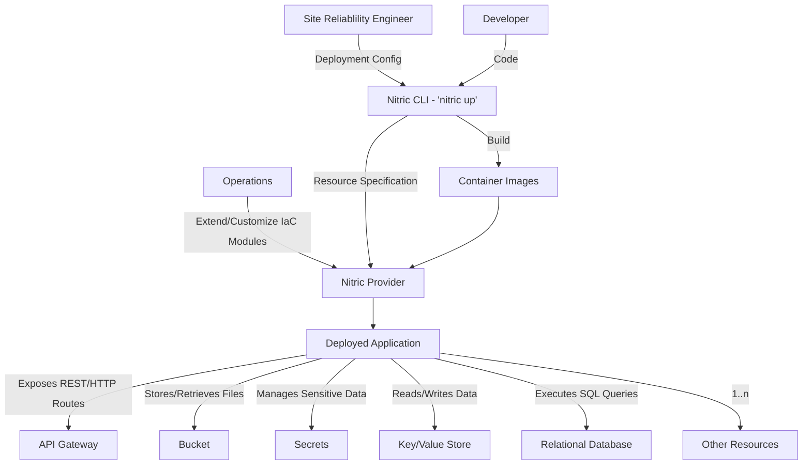
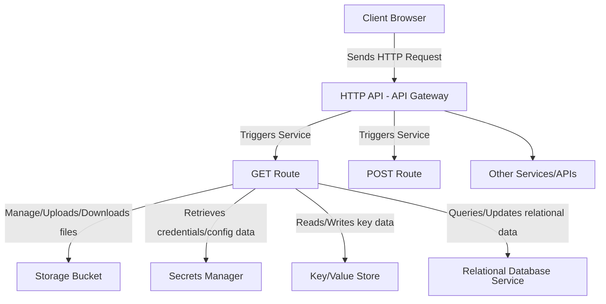
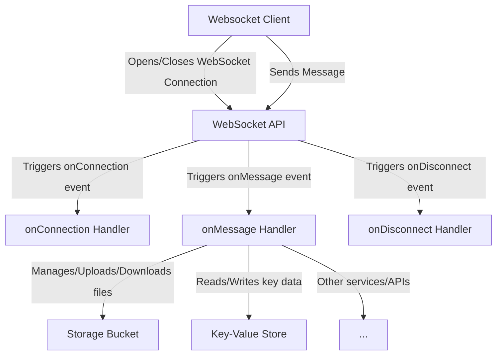
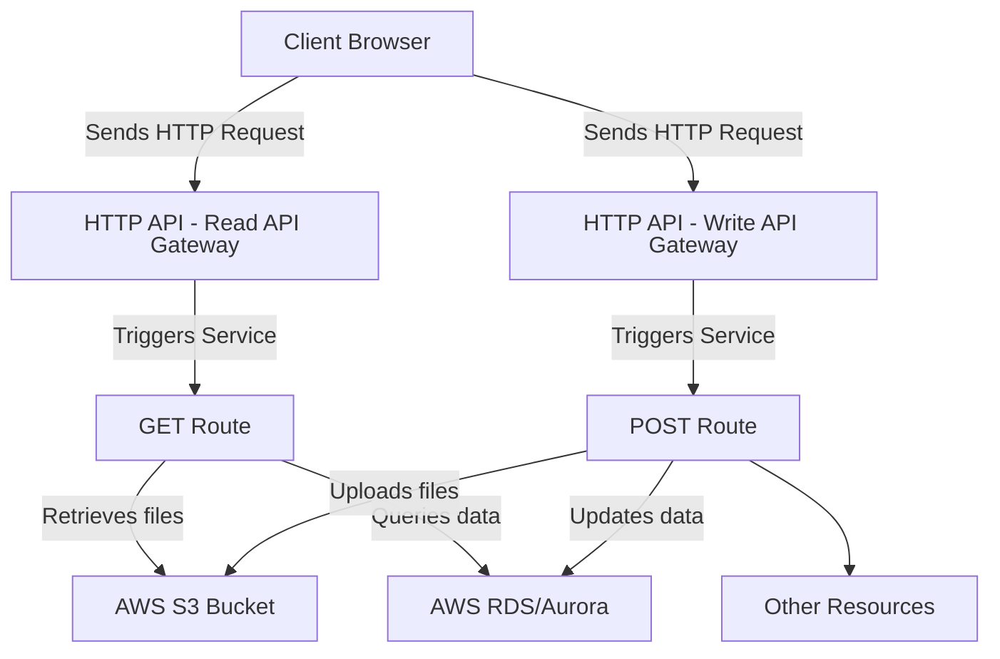
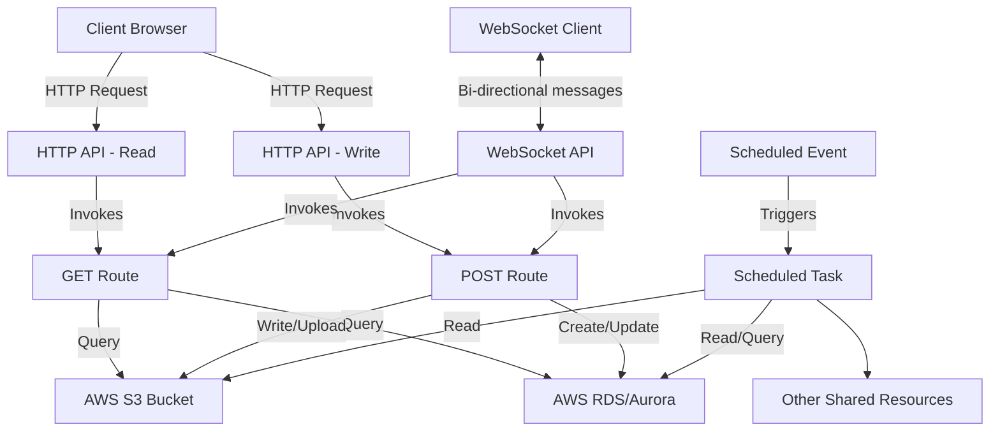

# Architecture Overview

Nitric allows your team to work together to build an application:

- **Developer**: Writes application code with built-in support for APIs, file storage (bucket), secrets, key/value store, and RDS, leveraging the Nitric SDK.
- **Operations**: Customize, extend or use Nitric's generated IaC (Terraform or Pulumi) to provision and manage the resources that the developer needs for their application.
- **SRE**: Configure environment/region/policy specific details, they also are heavily involved in overseeing that the Terraform modules themselves adhere to governance standards.
- **Nitric**: Automatically generates a specification for resource declarations and fulfills them by orchestrating a cloud deployment using IaC modules and container images tailored to the runtime requirements of the application code. While many of examples focus on AWS as the target cloud, Nitric's flexibility allows providers to support any cloud environment or even multiple clouds simultaneously.

The roles above may overlap depending on your organization structure, for example, it is not abnormal Developers to assume all roles, or for Operations and SRE responsibilities to be handled by the same team.

Nitric applications can have any number of APIs, Secrets, Buckets etc. Providers can also be extended to further support new resources, many which will work across all cloud providers and some that are cloud specific.

Interact seamlessly with services exposed through HTTP routes in an API gateway, as scheduled tasks, via event subscriptions, through WebSocket handlers, and more.

## Example: Handling HTTP requests

- The **Client Browser** sends an HTTP request to the **API Gateway**.
- The **API Gateway** acts as a proxy, forwarding the request to the appropriate **Services**.
- The **Services** process the request by coordinating with different resources like buckets, secrets, key/value store etc.

## Example: Handling Websockets

- The **Client Browser** opens a WebSocket connection.
- The **WebSocket** handles the connection lifecycle:
  - When the connection opens, it triggers the onConnect service.
  - Once the connection is established, messages from the client trigger the onMessage service.
  - When the connection closes, it triggers the onDisconnect service.
- The **onMessage**, **onConnect** and **onDisconnect** handlers:
  - Interact with other cloud resources e.g. Buckets, KeyValue stores and APIs.

## Example: Sharing resources

Deploy multiple APIs and other entrypoints into an application that can access shared resources.

- The **Client Browser** sends HTTP requests to the **API Gateways**.
- **API Gateways** and their respective service handlers are established with least privileges:
  - The Read API Gateway invokes the GET Route Service, which is granted read-only permissions.
  - The Write API Gateway invokes the POST Route Service, which is granted write-only permissions.

## Example: Multiple entry points

A Nitric application can have multiple entry points, such as an **HTTP API Gateway**, a **Scheduled Event**, and a **WebSocket API** all sharing the same resources.

- **Backend resources** (e.g. Key/Value Store, Bucket, RDS) are shared and accessed with **least-privilege** access from each service.
