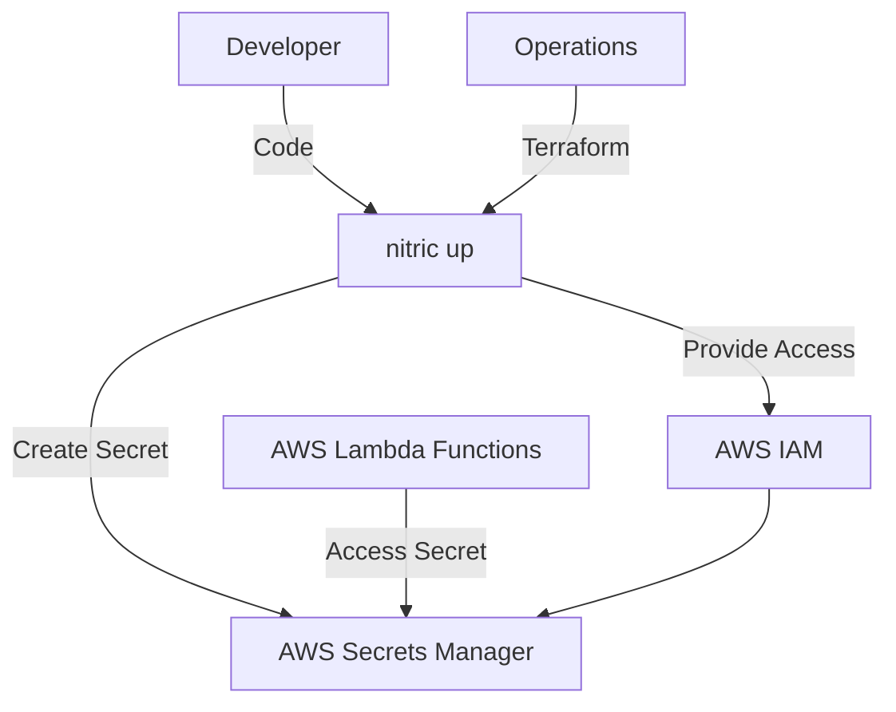
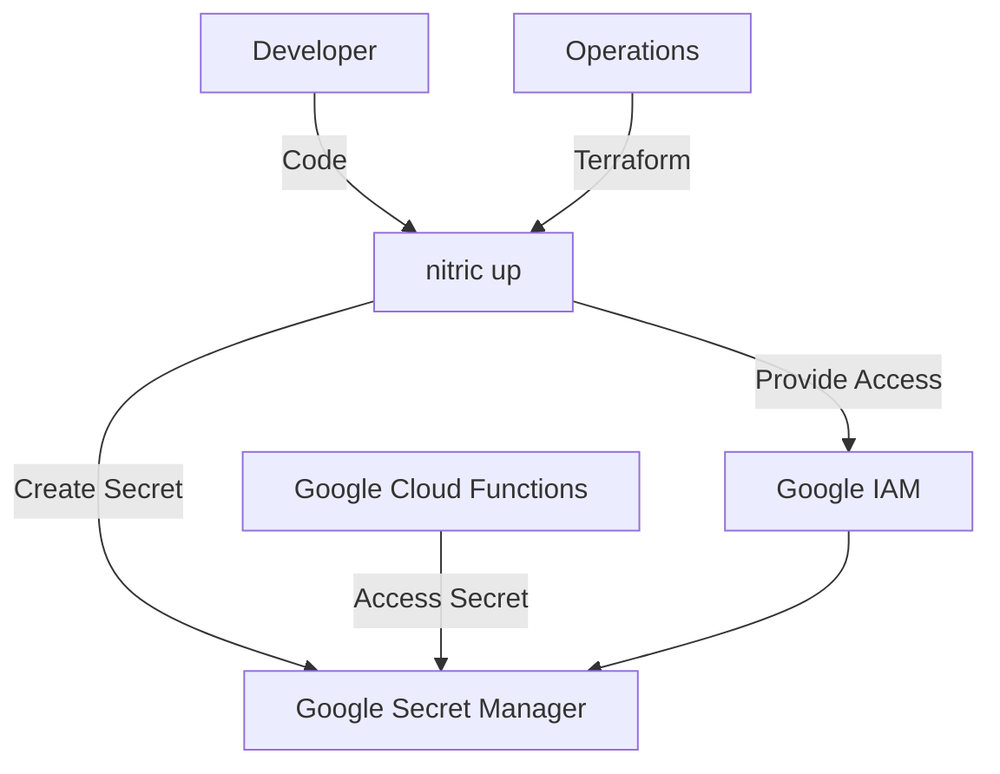
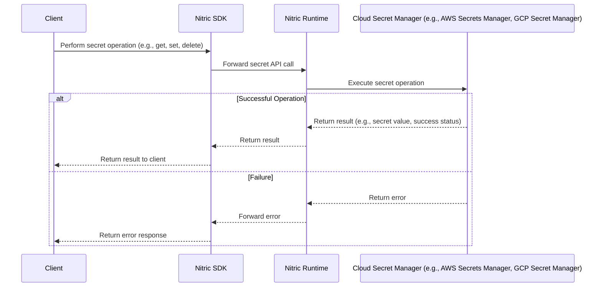

# Secrets

## 1. System Context

**Developers** use Nitric to declare secrets within their application.

- App code uses the [Secrets resource](/secrets) from the Nitric SDK.
- Developers configure secrets and implement application logic to securely access and manage these secrets.

**Operations** use default or overridden Terraform modules to provision the necessary resources for their target cloud.

  
Example AWS Provider

- **AWS Secrets Manager** stores and manages secrets.
- **AWS IAM** provides roles/policies for secure access to secrets.

  
Example GCP Provider

- **Google Secret Manager** stores and manages secrets.
- **Google IAM** provides roles/policies for secure access to secrets.

## 2. Sequence

## 3. Component

### Secrets Module

- Dynamically creates and manages secure storage for sensitive information, ensuring confidentiality and integrity.
- Configures secrets with appropriate metadata or tags for easy identification, tracking, and management.
- Enforces access control policies to restrict secret usage to authorized applications or services, following the principle of least privilege.
- Supports versioning of secrets to facilitate secure updates and rollback capabilities without service disruption.
- Provides seamless integration with application workflows by enabling dynamic retrieval and management of secrets.
- Abstracts the complexity of underlying secret management systems, allowing developers and operators to interact with a unified interface regardless of the cloud provider.

## 4. Code

**Developers** write application code that imports the 'secret' resource from the SDK, configures the secret, and implements the application logic to access and manage secrets.

SDK Reference by language -

- [NodeJS SDK](/reference/nodejs/secrets/secret)
- [Python SDK](/reference/python/secrets/secret)
- [GO SDK](/reference/go/secrets/secret)
- [Dart SDK](/reference/dart/secrets/secret)

**Operations** will use or extend the Nitric Terraform reference modules:

- [AWS Secret Terrform Module](https://github.com/nitrictech/nitric/blob/main/cloud/aws/deploytf/.nitric/modules/secret/main.tf)
- [GCP Secret Terrform Module](https://github.com/nitrictech/nitric/blob/main/cloud/gcp/deploytf/.nitric/modules/secret/main.tf)
