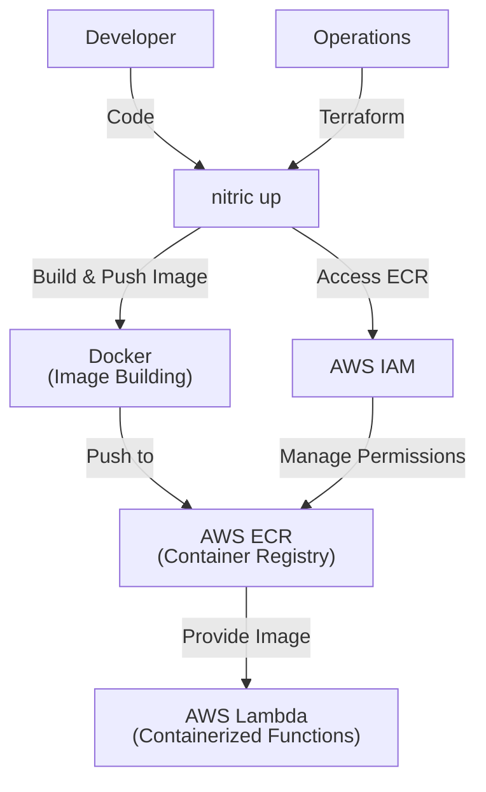
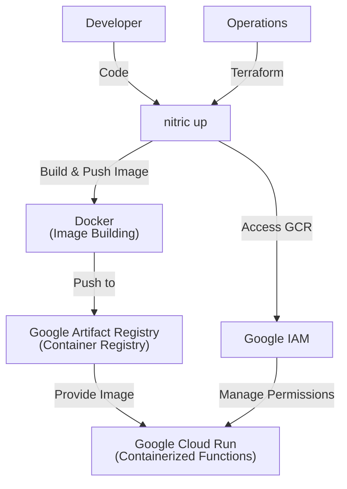
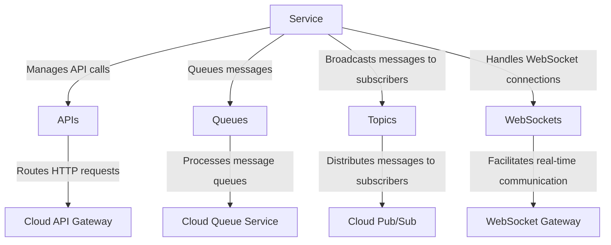
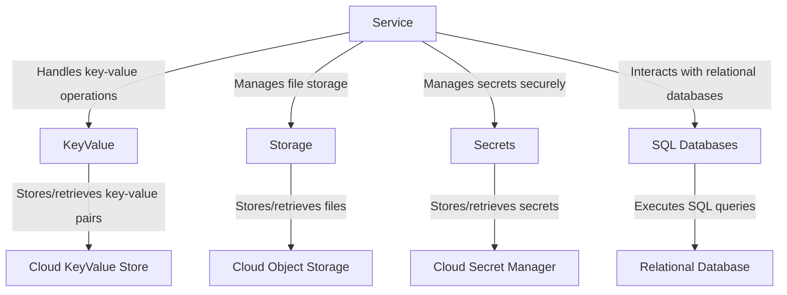
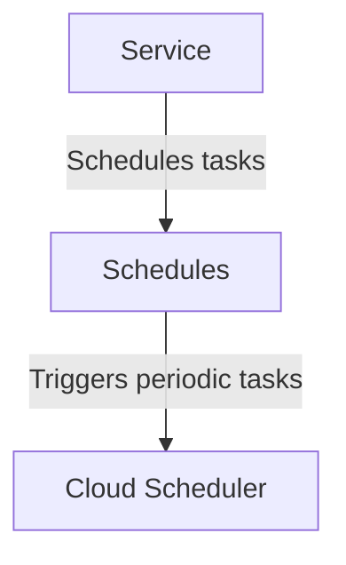

# Service Deployment

## 1. System Context

**Developers** use Nitric to create services or functions within their application.

- Application code is written in files that matches the pattern(s) in the nitric.yaml config file.
- The **Nitric CLI** builds container images for their Lambda functions and push them to a container registry.

**Operations** use default or overridden IaC (e.g Terraform modules) to provision the necessary resources for their target cloud.

<details>
  <summary>Example AWS Provider</summary>

- **AWS ECR (Elastic Container Registry)** stores container images for Lambda functions.
- **AWS Lambda** runs serverless functions based on the container images.
- **AWS IAM** manages roles and policies for secure access to AWS resources.
- **Docker** or **Podman** is used to build and tag container images before pushing them to ECR.



</details>
<details>
  <summary>Example GCP Provider</summary>

- **Docker** builds and tags the image, which is then pushed to **Google Artifact Registry (GCR)**.
- **Google IAM** ensures secure access, with the appropriate permissions for the Cloud Run service and service accounts.
- The **Cloud Run** service will run based on the container image pulled from **GCR**.



</details>

## 2. Container

General-purpose workers that handle tasks like processing queues, topics, or schedules. Services abstract the runtime’s ability to route tasks and events to application-defined logic.

### API & Event-Driven Communication



### Data Storage & Management



### Task Execution & Scheduling



## 3. Component

### Service Module

- Configures Terraform to handle the deployment and management of containerized services, abstracting away provider-specific details.
- Dynamically creates and manages a container registry for storing service container images, ensuring secure and efficient access.
- Automates authentication and tagging for container image pushes, supporting seamless integration with deployment pipelines.
- Creates a role with least privilege permissions for executing the service, including necessary trust relationships and policies for interacting with other resources.
- Configures containerized services with runtime parameters like environment variables, memory limits, and execution timeouts to optimize performance and scalability.
- Optionally supports advanced networking configurations like VPC settings for secure and isolated deployments.
- Abstracts the underlying infrastructure for running serverless or containerized services, enabling developers to focus on application logic while providing a consistent interface for operations teams.

## 4. Code

**Developers** write application code that implements handlers for the [api](/apis), [storage](/storage), [websocket](/websockets), [topic](/messaging#topics), [schedule](/schedules) resources. This code is written in files that matches the pattern(s) in the nitric.yaml file.

### Nitric service configuration - nitric.yaml

```yaml
name: service-name
services:
  - match: services/*.ts
    runtime: ''
    type: ''
    start: npm run dev:services $SERVICE_PATH
```

### HTTP Route Handler

```typescript
import { api } from '@nitric/sdk'

const customerRoute = api('public').route(`/customers`)

customerRoute.get((ctx) => {
  // construct response for the GET: /customers request...
  const responseBody = {}
  ctx.res.json(responseBody)
})
```

### Bucket On Read/Write/Delete Handler

```typescript
import { bucket } from '@nitric/sdk'

const assets = bucket('assets')

const accessibleAssets = bucket('assets').allow('delete')

// The request will contain the name of the file `key` and the type of event `type`
assets.on('delete', '*', (ctx) => {
  console.log(`A file named ${ctx.req.key} was deleted`)
})
```

**Operations** will use or extend the Nitric Terraform reference modules:

- [AWS Services Terraform Module](https://github.com/nitrictech/nitric/blob/main/cloud/aws/deploytf/.nitric/modules/service/main.tf)
- [GCP Services Terraform Module](https://github.com/nitrictech/nitric/blob/main/cloud/gcp/deploytf/.nitric/modules/service/main.tf)
