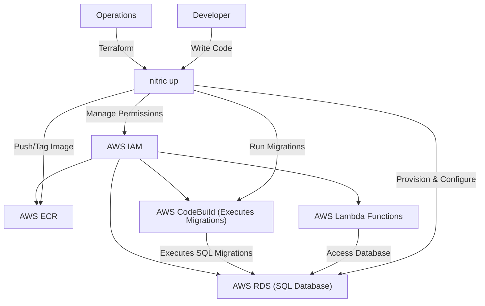
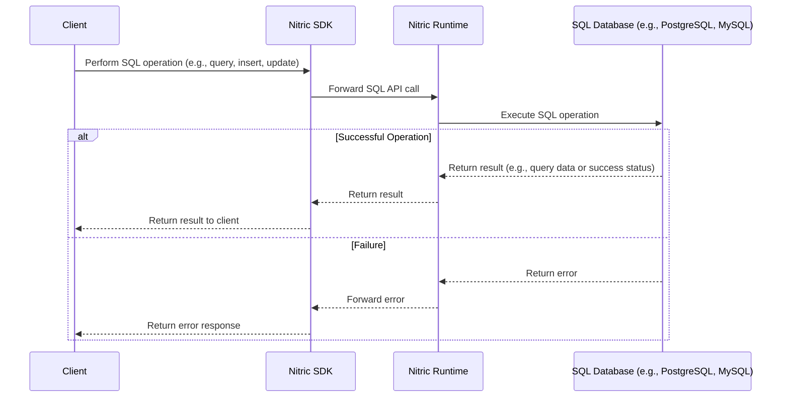

# SQL

## 1. System Context

**Developers** use Nitric to declare databases within their application (e.g., referencing a Postgres or MySQL database).

- App code uses the [SQL database resources](/sql) from the Nitric SDK.
- Developers can use any language specific client or ORM to interact with the databases.

**Operations** teams use default or customized Terraform modules to provision the required resources for the SQL database and for running database migrations:

  
Example AWS Provider

- **AWS RDS** (or another SQL provider) hosts the actual database.
- **AWS ECR** (Elastic Container Registry) stores the database migration image.
- **AWS CodeBuild** runs the migration image against the database on startup.
- **AWS IAM** manages roles and policies granting CodeBuild access to pull images from ECR, access VPC resources, and more.

## 2. Sequence Diagram (Level 2)

## 3. Component

### SQL Resource Module

- Configures a container registry for storing database migration images, ensuring secure and efficient image management.
- Dynamically tags and pushes migration images to the registry, streamlining deployment pipelines.
- Automates the setup of a migration execution environment using containerized tools, enabling seamless database schema updates and initialization.
- Provides an execution layer for running migrations against the SQL database, with monitoring to ensure successful completion.
- Abstracts the underlying SQL infrastructure, enabling consistent interactions with relational databases regardless of the cloud provider or database engine (e.g., PostgreSQL, MySQL).
- Optionally supports provisioning of the SQL database instance or cluster if not pre-existing, ensuring compatibility with the application.
- Enforces least privilege access by configuring secure roles and policies for database and migration operations, maintaining robust security standards.

## 4. Code

**Developers** write application code that uses the [SQL database resources](/sql) from the SDK, and implements the application logic to connect and interact with database.

SDK Reference by language -

- [NodeJS SDK](/reference/nodejs/sql/sql)
- [Python SDK](/reference/python/sql/sql)
- [GO SDK](/reference/go/sql/sql)
- [Dart SDK](/reference/dart/sql/sql)

**Operations** will use or extend the Nitric Terraform reference modules:

- [AWS SQL Terrform Module](https://github.com/nitrictech/nitric/blob/main/cloud/aws/deploytf/.nitric/modules/sql/main.tf)
