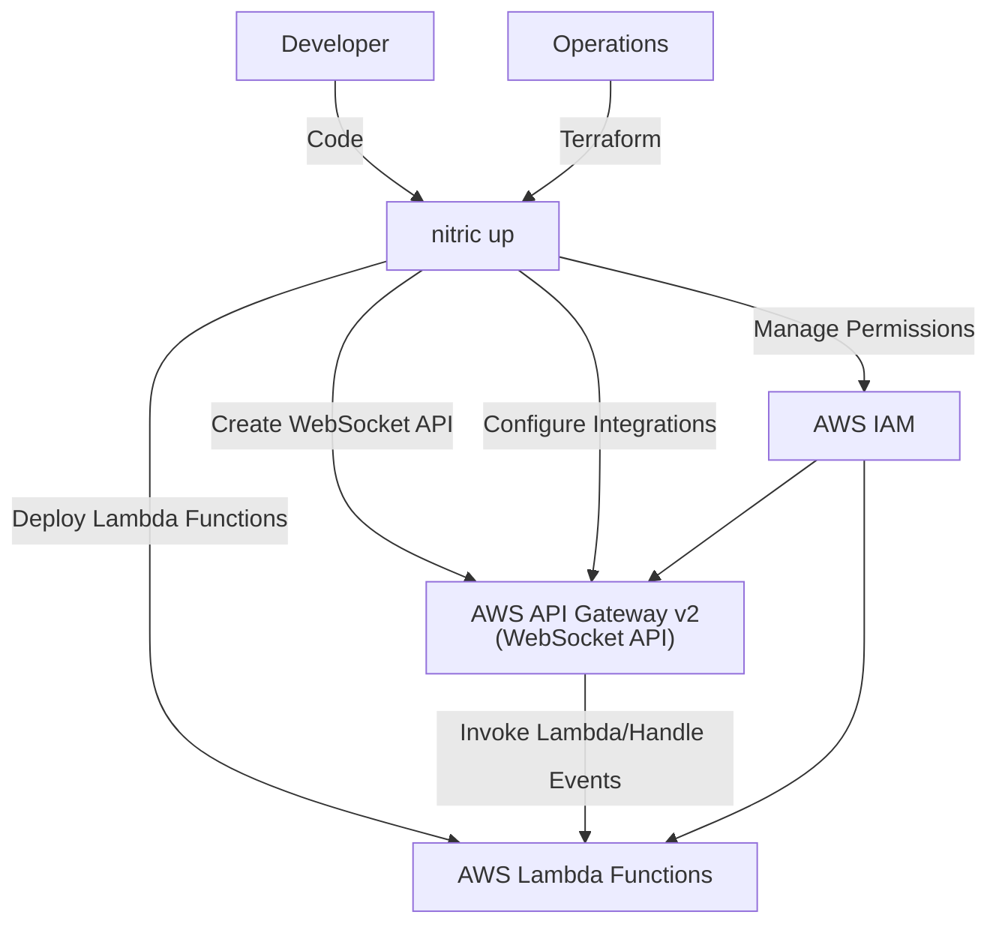
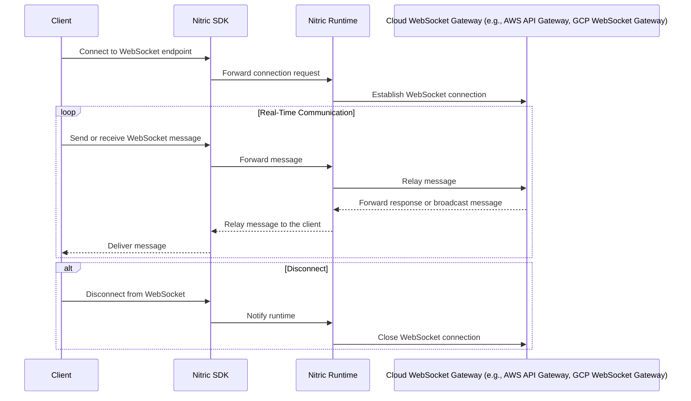

# WebSockets

## 1. System Context

**Developers** use Nitric to define required WebSocket APIs within their application.

- App code interacts with the [WebSocket resource](/websocket) through defined routes and integrations.
- Developers implement backend logic to handle WebSocket connections, messages, and disconnections.

**Operations** use default or overridden IaC (e.g Terraform modules) to provision the necessary resources for their target cloud.

  
Example AWS Provider

- **AWS API Gateway v2** manages WebSocket API endpoints and routes.
- **AWS Lambda** functions handle WebSocket events such as connection, message reception, and disconnection.
- **AWS IAM** manages roles and policies for secure access between API Gateway and Lambda functions.

## 2. Sequence

## 3. Component

### WebSocket API Module

- Dynamically creates and manages WebSocket APIs to enable real-time, bidirectional communication between clients and servers.
- Configures API properties such as protocol type, route selection expressions, and tags for governance and management.
- Automatically provisions and links backend integrations to handle events for connection establishment (`$connect`), message handling (`$default`), and disconnections (`$disconnect`).
- Grants permissions to enable secure communication between the WebSocket gateway and backend services, adhering to the principle of least privilege.
- Supports deployment of WebSocket APIs with automatic handling of stage configurations and versioning for seamless updates.
- Abstracts cloud-specific WebSocket services, ensuring a consistent developer experience across providers.
- Ensures fault-tolerant and scalable handling of WebSocket connections, supporting high-throughput scenarios with minimal configuration.

## 4. Code

**Developers** write application code that uses the [WebSocket resource](/websocket) from the SDK and implement backend logic to handle WebSocket connections, messages, and disconnections.

SDK Reference by language -

- [NodeJS SDK](/reference/nodejs/websocket/websocket)
- [Python SDK](/reference/python/websocket/websocket)
- [GO SDK](/reference/go/websocket/websocket)
- [Dart SDK](/reference/dart/websocket/websocket)

**Operations** will use or extend the Nitric Terraform reference modules:

- [AWS WebSocket Terrform Module](https://github.com/nitrictech/nitric/blob/main/cloud/aws/deploytf/.nitric/modules/websocket/main.tf)
