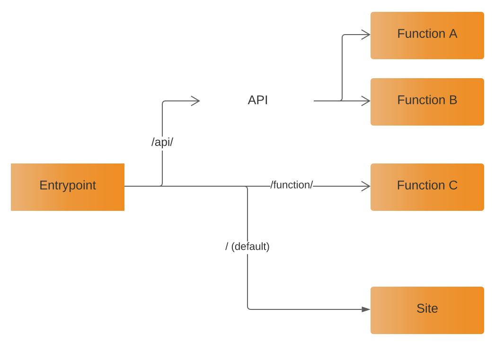

Nitric allows you to map a number of resources that can be hosted together and a single frontend/origin.

### How it works

Nitric entrypoints can be mapped to a number of managed services in the cloud in order to facilitate single origin application routing
and unlock CDN capability.



### Adding a new Entrypoint

Entrypoints are defined in a projects nitric.yaml file. The easiest way to add a new entrypoint is the `add:entrypoint` CLI command.

`nitric add:entrypoint <path> <type>:<name>`

For example: `nitric add:entrypoint / site:example`

This will add a new default entrypoint that references a site in your nitric yaml stack.\

Supported resource types are:

- [Functions](./functions)
- [Sites](./sites)
- [Apis](./apis)

> When defining entrypoints a default entrypoint `'/'` **MUST** be specified

### APIs as entrypoints

When adding an API as a non-default entrypoint it is important that the leading part of the entrypoint path **MUST** match the leading part of the API path.

<CodeExamples
languages={[
	{
		label: "Good 👍",
		value: "good"
	},
	{
		label: "Bad 👎",
		value: "bad"
	}
	]}
	defaultLang="good"
>
<CodeExample lang="good">

```yaml
name: example

# Define functions here
services:
  example:
    path: example
    runtime: official/golang15

# Define Sites here
sites:
  app:
    path: app
    assetPath: build
    buildScripts:
      - npm build

# Define APIs here
apis:
  exampleapi:
    openapi: 3.0.0
    info:
      version: 1.0.0
      title: Sample API
      description: A sample API to illustrate OpenAPI concepts
    paths:
      /exampleapi/example:
        get:
          operationId: example
          x-nitric-target:
            name: example
            type: function
          description: Says random quote
          responses:
            "200":
              description: Successful response

# Define nitric application entrypoints here
entrypoints:
  /:
    name: app
    type: site
  # 👍 Matches the base path of the above API
  /exampleapi/:
    name: exampleapi
    type: api
```

</CodeExample>
<CodeExample lang="bad">

```yaml
name: example

# Define functions here
services:
  example:
    path: example
    runtime: official/golang15

# Define Sites here
sites:
  app:
    path: app
    assetPath: build
    buildScripts:
      - npm build

# Define APIs here
apis:
  exampleapi:
    openapi: 3.0.0
    info:
      version: 1.0.0
      title: Sample API
      description: A sample API to illustrate OpenAPI concepts
    paths:
      /exampleapi/example:
        get:
          operationId: example
          x-nitric-target:
            name: example
            type: function
          description: Says random quote
          responses:
            "200":
              description: Successful response

# Define nitric application entrypoints here
entrypoints:
  /:
    name: app
    type: site
  # 👎 Doesn't match the base path of the above API
  /myapi/:
    name: exampleapi
    type: api
```

</CodeExample>
</CodeExamples>

### Testing your entrypoints

The easiest way to test your entrypoints locally is via the nitric run command. This will deploy an additional frontend along with your other stack
resources in order to serve your stack under a single origin.

`nitric dev run`

In the output you should receive a link that indicates where you can reach your application via the nitric entrypoints.

`Your application entrypoint is available at http://localhost:<port>`
