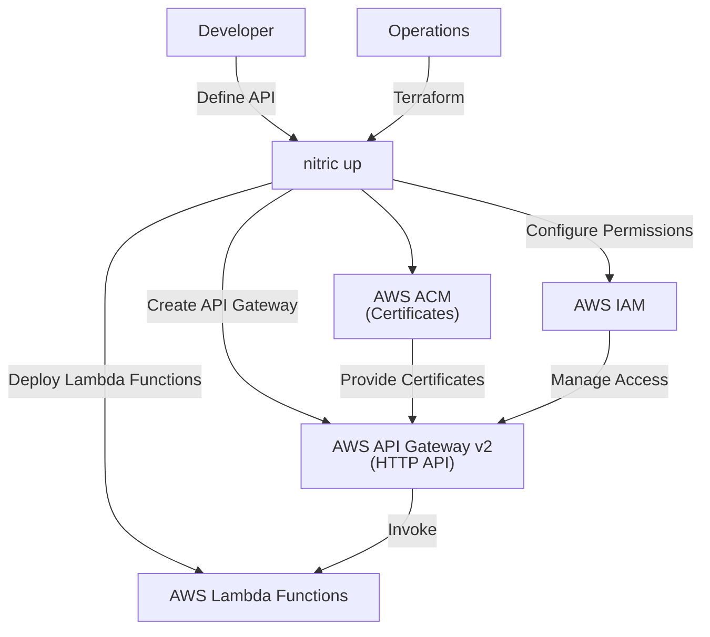
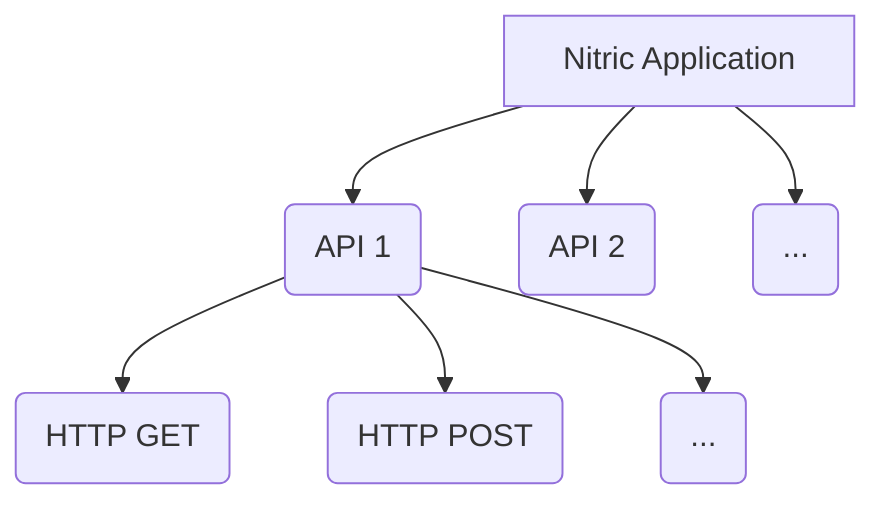

# Nitric 'API' Architecture

## 1. System Context (Level 1)

- A **Developer** uses Nitric to create and manage APIs within their application.
  - App code interacts with the **API resource** through defined endpoints.
  - Developers define API specifications and implement backend logic to handle requests.
- **Operations** use default or overridden Terraform modules to provision the necessary AWS API Gateway resources.
  - **AWS API Gateway v2** serves as the HTTP API management service.
  - **AWS Lambda** functions are deployed to handle API requests.
  - **AWS IAM** (implicitly assumed) provides roles and policies for secure interaction between API Gateway and Lambda functions.
  - **AWS ACM** manages SSL/TLS certificates for custom domain names.



## 2. Container (Level 2)

Each **API** is managed through AWS API Gateway v2 and interacts with backend Lambda functions to process HTTP requests.



## 3. Component (Level 3)

### API Module

- **aws_apigatewayv2_api.api_gateway**
  - Creates an AWS API Gateway v2 HTTP API.
  - Configures the API name, protocol type, API specification (`body`), and tags for identification and management.
- **aws_apigatewayv2_stage.stage**
  - Creates a stage for the API Gateway.
  - Sets the stage name to `$default` and enables automatic deployment of changes.
- **aws_lambda_permission.apigw_lambda**
  - Grants API Gateway permission to invoke the specified Lambda functions.
  - Iterates over `var.target_lambda_functions` to set permissions for each target function.
- **data.aws_acm_certificate.cert**
  - Looks up existing ACM certificates for the specified domains.
  - Iterates over `var.domains` to retrieve certificate details for each domain.
- **aws_apigatewayv2_domain_name.domain**

  - Creates custom domain names for the API Gateway using the retrieved ACM certificates.
  - Configures domain name settings, including the certificate ARN, endpoint type, and security policy.

## 4. Code (Level 4)

**Developers** write application code that imports the 'api' resource from the SDK, configures the api, and implements HTTP routes, implement middleware, etc.

```typescript
import { api } from '@nitric/sdk'

const publicApi = api('public')

api('public').get('/customers', (ctx) => {
  // construct response for the GET: /customers request...
  const responseBody = {}
  ctx.res.json(responseBody)
})

const authMiddleware = async (ctx, next) => {
  // Perform auth validation.
  return await next(ctx)
}

const privateApi = api('private', { middleware: authMiddleware })
```

**Operations** will use the provided Terraform module to create and manage the AWS API Gateway as defined.

```hcl
resource "aws_apigatewayv2_api" "api_gateway" {
  name          = var.name
  protocol_type = "HTTP"
  body = var.spec
  tags = {
    "x-nitric-${var.stack_id}-name" = var.name,
    "x-nitric-${var.stack_id}-type" = "api",
  }
}

resource "aws_apigatewayv2_stage" "stage" {
  api_id = aws_apigatewayv2_api.api_gateway.id
  name   = "$default"
  auto_deploy = true
}

# deploy lambda permissions for execution
resource "aws_lambda_permission" "apigw_lambda" {
  for_each      = var.target_lambda_functions
  action        = "lambda:InvokeFunction"
  function_name = each.value
  principal     = "apigateway.amazonaws.com"
  source_arn    = "${aws_apigatewayv2_api.api_gateway.execution_arn}/*/*/*"
}

# look up existing certificate for domains
data "aws_acm_certificate" "cert" {
  for_each = var.domains
  domain = each.value
}

# deploy custom domain names
resource "aws_apigatewayv2_domain_name" "domain" {
  for_each = var.domains
  domain_name = each.value
  domain_name_configuration {
    certificate_arn = data.aws_acm_certificate.cert[each.key].arn
    endpoint_type = "REGIONAL"
    security_policy = "TLS_1_2"
  }
}
```
