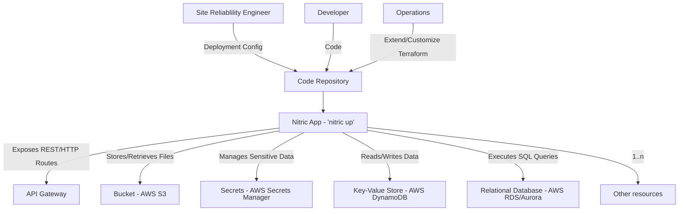
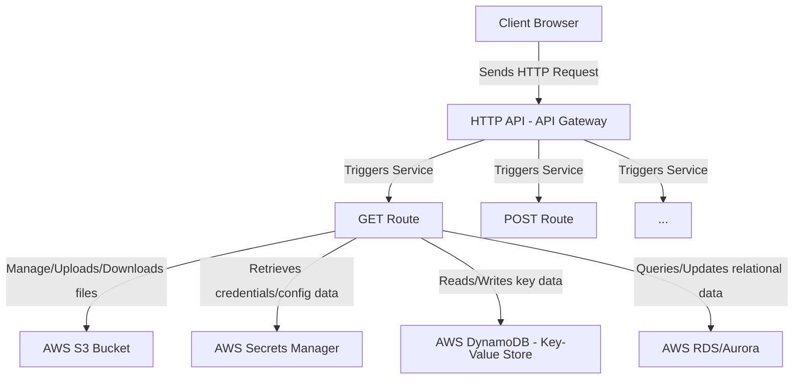

# Nitric High-Level Architecture

Nitric allows your team to work together to build an application:

- **Developer**: Writes application code with built-in support for APIs, file storage (bucket), secrets, key‑value store, and RDS, leveraging the Nitric SDK.
- **Operations**: Customize, extend or use Nitric's generated IaC (Terraform or Pulumi) to provision and manage the resources that the developer needs for their application.
- **SRE**: Configure environment/region/policy specific details, they also are heavily involved in overseeing that the Terraform modules themselves adhere to governance standards.

The roles above may overlap depending on your organization structure, for example, it is not abnormal Developers to assume all roles, or for Operations and SRE responsibilities to be handled by the same team.

Nitric applications can have any number of APIs, Secrets, Buckets etc. Providers can also be extended to further support new resources, many which will work across all cloud providers and some that are cloud specific.

## Example: Handling HTTP requests.

Interaction with services that have been exposed as HTTP routes within an API gateway, Scheduled tasks, Event subscriptions, WebSocket handlers and more.

- The **Client Browser** sends an HTTP request to the **API Gateway**.
- The **API Gateway** acts as a proxy, forwarding the request to the appropriate **Services**.
- The **Services** process the request by coordinating with different backend services, this is done through :
  - They interact with one or more **AWS S3 Bucket** to manage files.
  - They retrieve credentials or configuration from **AWS Secrets Manager**.
  - They use **AWS DynamoDB** for fast key-value operations.
  - They query or update structured data in **AWS RDS/Aurora**.
