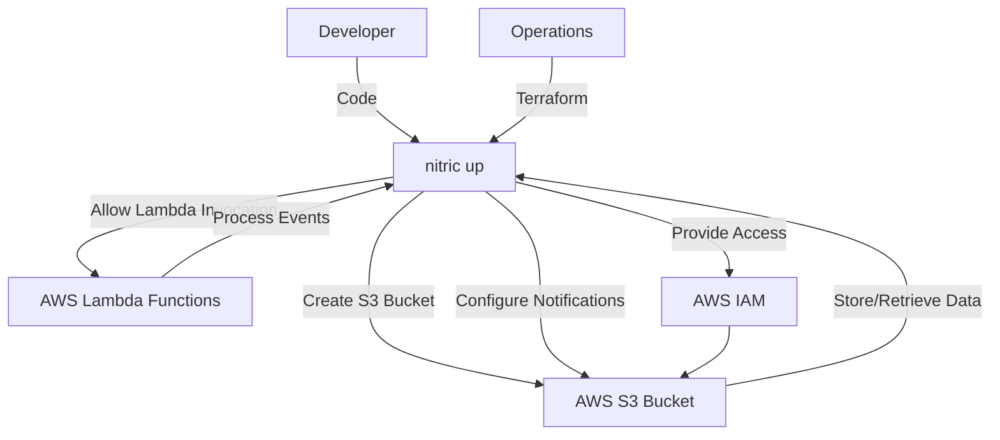
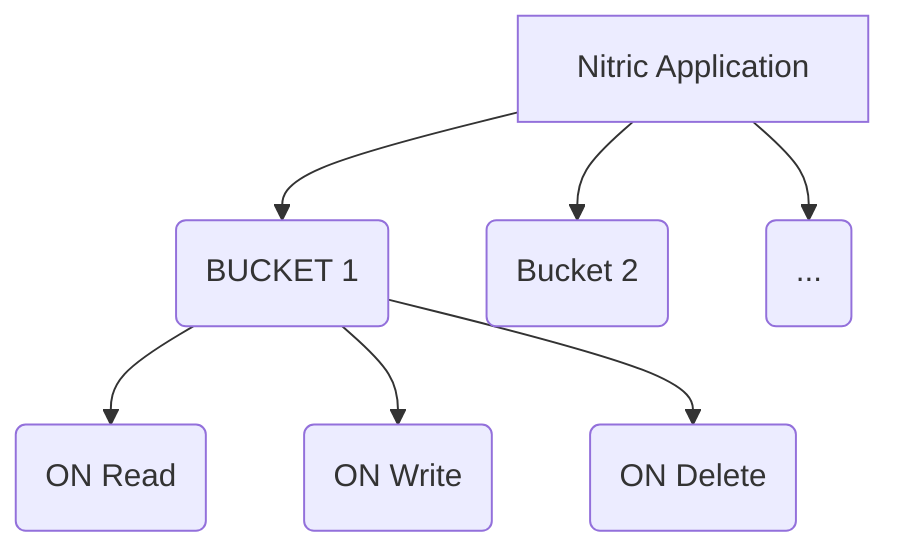

# Nitric 'Bucket' Architecture

## 1. System Context (Level 1)

- A **Developer** uses Nitric to manage S3 buckets within their application.
  - App code imports the **Bucket resource** from the Nitric SDK.
  - Developers configure buckets and implement application logic to securely access and manipulate bucket data.
  - Developers can also implement hanlders for on events like on read, write or delete.
- **Operations** use default or overridden Terraform modules to provision the necessary AWS S3 resources.
  - **AWS S3** serves as the storage backend.
  - **AWS Lambda** functions are used to process events triggered by S3.
  - **AWS IAM** provides roles and policies for secure access to S3 buckets and Lambda functions.
  - **Random ID** resource is used to generate unique bucket names.



## 2. Container (Level 2)

Each **Bucket** is managed through AWS S3 and accessed by the application through securely configured mechanisms provided by Nitric.



## 3. Component (Level 3)

### Bucket Module

- **random_id.bucket_id**
  - Generates a random ID for the S3 bucket to ensure unique naming.
- **aws_s3_bucket.bucket**
  - Creates an AWS S3 bucket with a unique name by appending the generated random ID.
  - Configures tags for identification and management.
- **aws_lambda_permission.allow_bucket**
  - Grants AWS S3 permission to invoke the specified Lambda functions.
  - Iterates over `var.notification_targets` to set permissions for each target.
- **aws_s3_bucket_notification.bucket_notification**
  - Configures S3 bucket notifications to trigger Lambda functions based on specified events.
  - Uses dynamic blocks to handle multiple Lambda function notifications.

## 4. Code (Level 4)

**Developers** write application code that imports the 'bucket' resource from the SDK, configures the bucket, and implements the application logic to read, write and delete files.

```typescript
import { bucket } from '@nitric/sdk'

const profiles = bucket('profiles').allow('read')

const image = await profiles.file('users/bruce-wayne/profile.png').read()
```

**Operations** will use the provided Terraform module to create and manage the AWS S3 Buckets as defined.

```hcl

# Generate a random id for the bucket
resource "random_id" "bucket_id" {
  byte_length = 8

  keepers = {
    # Generate a new id each time we switch to a new AMI id
    bucket_name = var.bucket_name
  }
}

# AWS S3 bucket
resource "aws_s3_bucket" "bucket" {
  bucket = "${var.bucket_name}-${random_id.bucket_id.hex}"

  tags = {
    "x-nitric-${var.stack_id}-name" = var.bucket_name
    "x-nitric-${var.stack_id}-type" = "bucket"
  }
}

# Deploy bucket lambda invocation permissions
resource "aws_lambda_permission" "allow_bucket" {
  for_each = var.notification_targets
  action        = "lambda:InvokeFunction"
  function_name = each.value.arn
  principal     = "s3.amazonaws.com"
  source_arn    = aws_s3_bucket.bucket.arn
}

# Deploy lambda notifications
resource "aws_s3_bucket_notification" "bucket_notification" {
  bucket = aws_s3_bucket.bucket.id

  // make dynamic blocks for lambda function
  dynamic "lambda_function" {
    for_each = var.notification_targets
    content {
      lambda_function_arn = lambda_function.value.arn
      events              = lambda_function.value.events
      filter_prefix       = lambda_function.value.prefix
    }
  }
}
```
