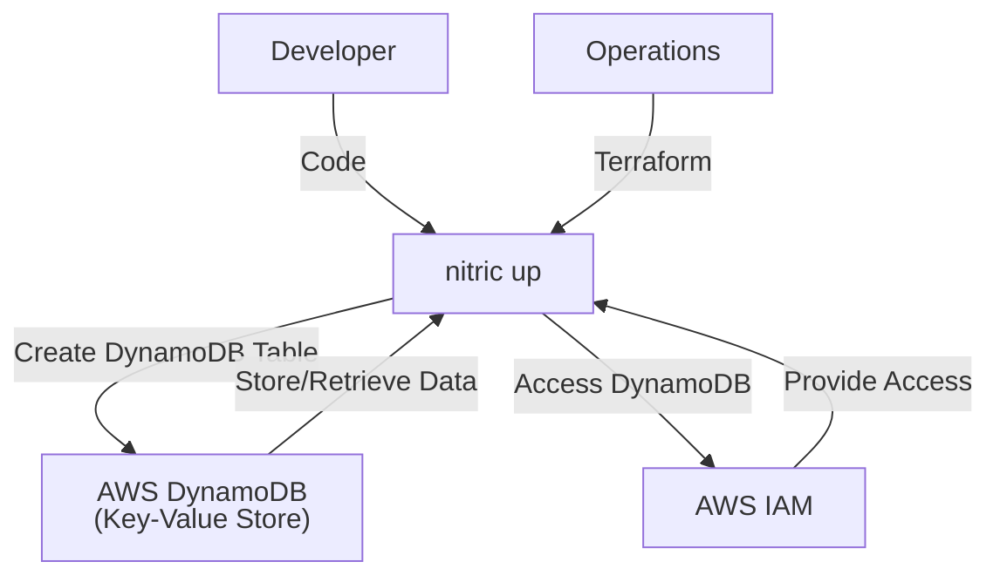
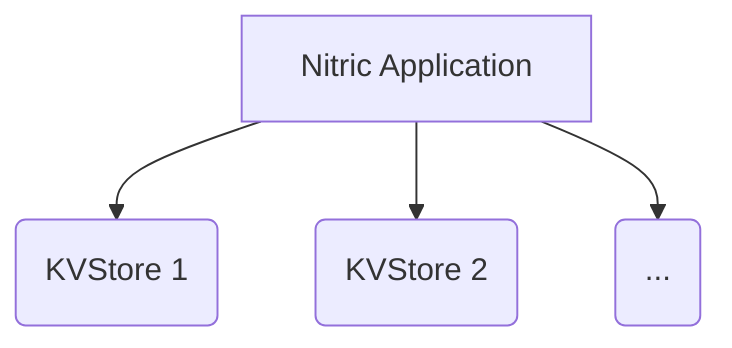

# Nitric 'KVStore' Architecture

## 1. System Context (Level 1)

- A **Developer** uses Nitric to manage key-value stores within their application.
  - App code imports the **KVStore resource** from the Nitric SDK.
  - Developers configure key-value stores and implement application logic to securely access and manipulate data.
- **Operations** use default or overridden Terraform modules to provision the necessary AWS DynamoDB resources.
  - **AWS DynamoDB** serves as the key-value store backend.
  - **AWS IAM** provides roles and policies for secure access to DynamoDB tables.



## 2. Container (Level 2)

Each **KVStore** is managed through AWS DynamoDB and accessed by the application through securely configured mechanisms provided by Nitric.



## 3. Component (Level 3)

### KVStore Module

- **aws_dynamodb_table.table**
  - Deploys an AWS DynamoDB table with specified attributes, hash key, range key, billing mode, and tags for identification and management.

## 4. Code (Level 4)

**Developers** write application code that imports the 'secret' resource from the SDK, configures the secret, and implements the application logic to access and manage secrets.

```typescript
import { kv } from '@nitric/sdk'

const countries = kv('Countries').allow('delete', 'set')

await countries.set('USA', {
  name: 'United States of America',
  population: 329500000,
})

await countries.delete('USA')
```

**Operations** will use the provided Terraform module to create and manage the KeyValue store as defined.

```hcl
# Deploy an aws dynamodb table
resource "aws_dynamodb_table" "table" {
  name         = var.kvstore_name
  attribute {
    name = "_pk"
    type = "S"
  }
  attribute {
    name = "_sk"
    type = "S"
  }
  hash_key  = "_pk"
  range_key = "_sk"
  billing_mode = "PAY_PER_REQUEST"
  tags = {
    "x-nitric-${var.stack_id}-name" = var.kvstore_name
    "x-nitric-${var.stack_id}-type" = "kvstore"
  }
}
```
