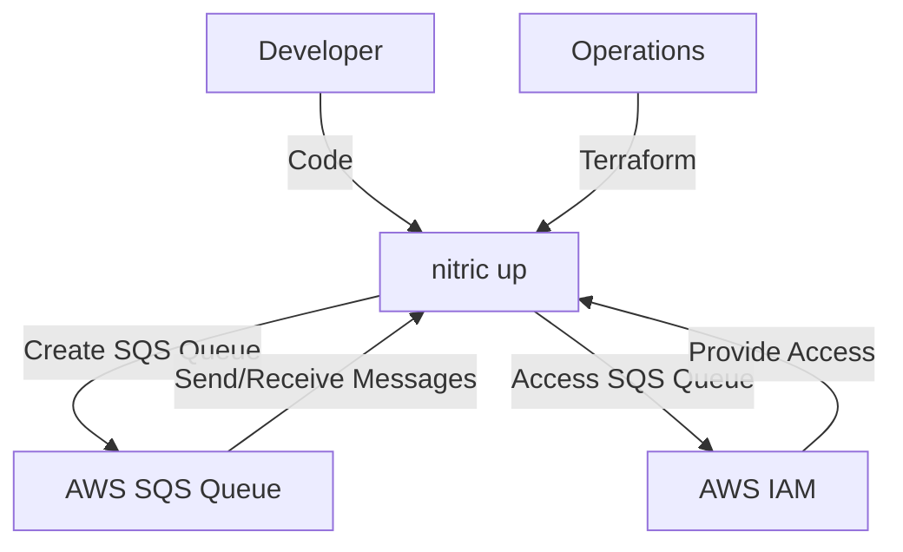
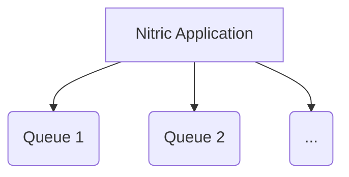

# Nitric 'Queue' Architecture

## 1. System Context (Level 1)

- A **Developer** uses Nitric to manage message queues within their application.
  - App code imports the **Queue resource** from the Nitric SDK.
  - Developers configure queues and implement application logic to send and receive messages.
- **Operations** use default or overridden Terraform modules to provision the necessary AWS SQS resources.
  - **AWS SQS** serves as the message queuing service.
  - **AWS IAM** provides roles and policies for secure access to SQS queues.



## 2. Container (Level 2)

Each **Queue** is managed through AWS SQS and accessed by the application through securely configured mechanisms provided by Nitric.



## 3. Component (Level 3)

### Queue Module

- **aws_sqs_queue.queue**
  - Deploys an AWS SQS queue with a specified name.
  - Configures tags for identification and management.

## 4. Code (Level 4)

**Developers** write application code that imports the 'secret' resource from the SDK, configures the secret, and implements the application logic to access and manage secrets.

```typescript
import { queue } from '@nitric/sdk'

const payload = {}
const batchQueue = queue('batch').allow('dequeue')

const messages = await batchQueue.enqueue()
```

**Operations** will use the provided Terraform module to create and manage the AWS SQS queues as defined.

```hcl
# Deploy an SQS queue
resource "aws_sqs_queue" "queue" {
  name = var.queue_name
  tags = {
    "x-nitric-${var.stack_id}-name" = var.queue_name
    "x-nitric-${var.stack_id}-type" = "queue"
  }
}
```
