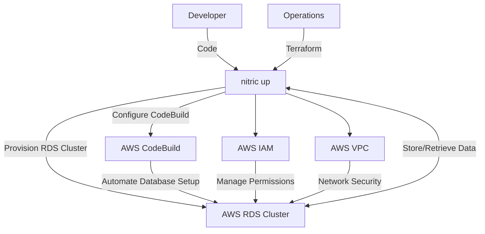
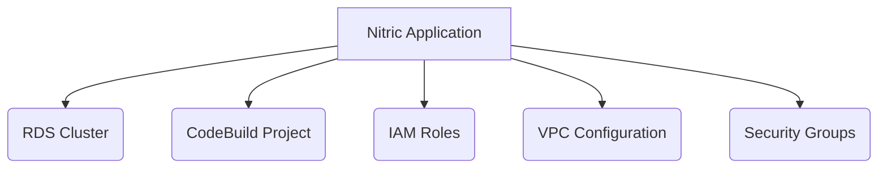

# Nitric 'RDS' Architecture

## 1. System Context (Level 1)

- A **Developer** uses Nitric to manage relational databases and automate database creation within their application.
  - App code interacts with the **RDS Cluster** for data storage and retrieval.
  - Developers utilize **CodeBuild** projects to automate database setup and migrations.
- **Operations** use default or overridden Terraform modules to provision the necessary AWS resources.
  - **AWS RDS** provides a scalable and managed relational database service.
  - **AWS CodeBuild** automates the process of setting up and managing the database schema.
  - **AWS IAM** manages roles and permissions for secure access to AWS resources.
  - **AWS VPC** ensures network isolation and security for the database instances.



## 2. Container (Level 2)

The system comprises several AWS services orchestrated through Terraform to provide a secure and scalable relational database environment with automated deployment capabilities.



## 3. Component (Level 3)

### RDS Module

- **random_password.rds_password**
  - Generates a secure random password for the RDS cluster.
- **aws_db_subnet_group.rds_subnet_group**
  - Creates a subnet group for the RDS instance to ensure it is deployed within the specified private subnets.
- **aws_security_group.rds_security_group**
  - Defines a security group for the RDS instance, allowing inbound traffic on port 5432 (PostgreSQL) from within the VPC and allowing all outbound traffic.
- **aws_iam_role.codebuild_role**
  - Creates an IAM role for AWS CodeBuild with a trust relationship allowing CodeBuild to assume the role.
- **aws_iam_role_policy_attachment.codebuild_managed_policies**
  - Attaches managed IAM policies to the CodeBuild role to grant necessary permissions for CodeBuild operations.
- **aws_rds_cluster.rds_cluster**
  - Creates an AWS RDS cluster with Aurora PostgreSQL engine, configuring it for serverless v2 with specified scaling parameters.
- **aws_rds_cluster_instance.rds_cluster_instance**
  - Creates an instance within the RDS cluster, specifying the instance class and engine details.
- **aws_codebuild_project.create_database**
  - Sets up an AWS CodeBuild project to automate the creation of the database within the RDS cluster. It includes environment variables, VPC configuration, and build specifications.

## 4. Code (Level 4)

**Developers** write application code that imports the 'rds' resource from the SDK, configures and connects to an RDS.

```typescript
import { api, sql } from '@nitric/sdk'
import { PrismaClient } from '@prisma/client'

const mainApi = api('main')
const db = sql('my-data')

let prisma
const getClient = async () => {
  // ensure we only create the client once
  if (!prisma) {
    const connectionString = await db.connectionString()

    prisma = new PrismaClient({
      datasourceUrl: connectionString,
    })
  }
  return prisma
}
```

**Operations** will use the provided Terraform module to create and manage the AWS RDS as defined.

```hcl
# Create a new random password for the RDS cluster
resource "random_password" "rds_password" {
  length  = 16
  special = false
}

# Create a subnet group for the RDS instance
resource "aws_db_subnet_group" "rds_subnet_group" {
  subnet_ids = var.private_subnet_ids
}

# Create a security group for the RDS instance
resource "aws_security_group" "rds_security_group" {
  vpc_id = var.vpc_id

  ingress {
    from_port = 5432
    to_port   = 5432
    protocol  = "tcp"
    self      = true
  }

  egress {
    from_port   = 0
    to_port     = 0
    protocol    = "-1"
    cidr_blocks = ["0.0.0.0/0"]
  }
}

#  Create a role for the codebuild job
resource "aws_iam_role" "codebuild_role" {
  name = "nitric-codebuild-role"
  assume_role_policy = jsonencode({
    Version = "2012-10-17",
    Statement = [
      {
        Effect = "Allow",
        Principal = {
          Service = "codebuild.amazonaws.com"
        },
        Action = "sts:AssumeRole"
      }
    ]
  })
}

# Attach managed policies to the codebuild role
locals {
  codebuildManagedPolicies = {
    "codeBuildAdmin" = "arn:aws:iam::aws:policy/AWSCodeBuildAdminAccess"
    "rdsAdmin"       = "arn:aws:iam::aws:policy/AmazonRDSFullAccess"
    "ec2Admin"       = "arn:aws:iam::aws:policy/AmazonEC2FullAccess"
    "cloudWatchLogs" = "arn:aws:iam::aws:policy/CloudWatchLogsFullAccess"
    "ecrReadonly"    = "arn:aws:iam::aws:policy/AmazonEC2ContainerRegistryReadOnly"
  }
}

resource "aws_iam_role_policy_attachment" "codebuild_managed_policies" {
  for_each = local.codebuildManagedPolicies

  role       = aws_iam_role.codebuild_role.name
  policy_arn = each.value
}

# Create an RDS cluster with serverless v2
resource "aws_rds_cluster" "rds_cluster" {
  cluster_identifier     = "nitric-rds-cluster"
  engine                 = "aurora-postgresql"
  engine_mode            = "provisioned"
  engine_version         = "13.14"
  database_name          = "nitric"
  master_username        = "nitric"
  master_password        = random_password.rds_password.result
  db_subnet_group_name   = aws_db_subnet_group.rds_subnet_group.id
  vpc_security_group_ids = [aws_security_group.rds_security_group.id]
  skip_final_snapshot    = true
  deletion_protection    = false
  serverlessv2_scaling_configuration {
    max_capacity = var.max_capacity
    min_capacity = var.min_capacity
  }
}

# Create a rds cluster instance
resource "aws_rds_cluster_instance" "rds_cluster_instance" {
  cluster_identifier   = aws_rds_cluster.rds_cluster.id
  instance_class       = "db.serverless"
  engine               = aws_rds_cluster.rds_cluster.engine
  engine_version       = aws_rds_cluster.rds_cluster.engine_version
  db_subnet_group_name = aws_rds_cluster.rds_cluster.db_subnet_group_name
}


# Create an AWS Codebuild job to create a database on the RDS cluster
resource "aws_codebuild_project" "create_database" {
  name          = "nitric-create-database"
  description   = "Create the database on the RDS cluster"
  build_timeout = 60
  service_role  = aws_iam_role.codebuild_role.arn

  artifacts {
    type = "NO_ARTIFACTS"
  }


  environment {
    compute_type = "BUILD_GENERAL1_SMALL"
    image        = "aws/codebuild/amazonlinux2-x86_64-standard:4.0"
    type         = "LINUX_CONTAINER"

    environment_variable {
      name = "DB_PASSWORD"
      value = random_password.rds_password.result
      type = "PLAINTEXT"
    }
  }


  vpc_config {
    subnets            = var.private_subnet_ids
    security_group_ids = aws_rds_cluster.rds_cluster.vpc_security_group_ids
    vpc_id             = var.vpc_id
  }

  source {
    type = "NO_SOURCE"
    buildspec = jsonencode({
      version = "0.2",
      phases = {
        build = {
          commands = [
            "echo 'Creating database $DB_NAME'",
            # FIXME: Store the password in a secret manager
            "export PGPASSWORD=$${DB_PASSWORD}",
            # "CREATE DATABASE ${DB_NAME}" || echo "database ${DB_NAME} already exists"
            "psql -h ${aws_rds_cluster.rds_cluster.endpoint} -U ${aws_rds_cluster.rds_cluster.master_username} -d ${aws_rds_cluster.rds_cluster.database_name} -c \"CREATE DATABASE $${DB_NAME}\" || echo \"database $${DB_NAME} already exists\""
          ]
        }
      }
    })
  }
}
```
