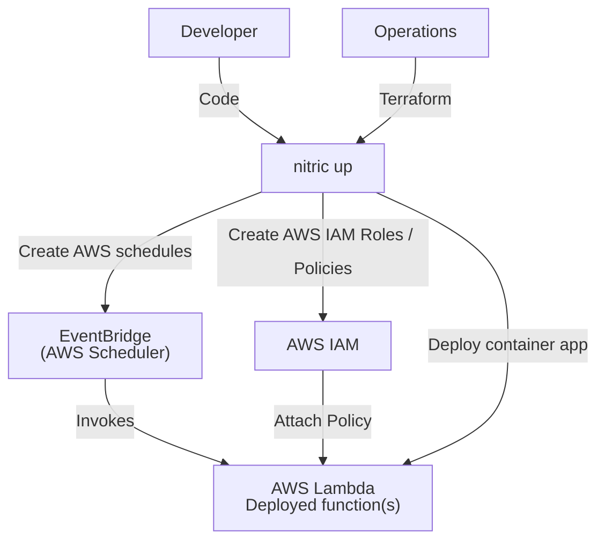
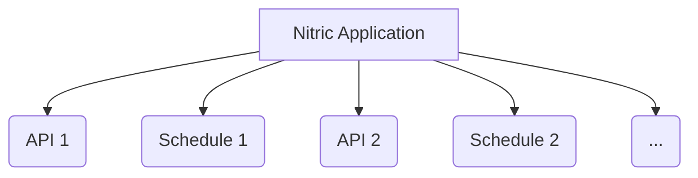

# Nitric 'Schedule' Architecture

## 1. System Context (Level 1)

- A **Developer** uses Nitric to write and deploy their application,
  - App code will import the **Schedule resource** from the Nitric SDK.
  - Developers configure the schedule with CRON or rate expressions like '7 days' and implement application logic to be executed.
- **Operations** use default/extended or overridden Terraform modules to provision the neccessary resources to run the schedule.
  - **Lambda function** is deployed as a packaged container image uploaded to an Amazon Elastic Container Registry (Amazon ECR).
  - **AWS EventBridge** is used to schedule and trigger Lambda functions.
  - **AWS IAM** provides the role/policies allowing EventBridge to invoke the Lambda functions securely.



## 2. Container (Level 2)

Each **Schedule** is deployed as a Lambda function from a container image that has been packaged with either Docker or Podman and uploaded to an Amazon Elastic Container Registry (Amazon ECR) repository.



## 3. Component (Level 3)

Schedules Module

- **aws_iam_role.role** creates the IAM role for `scheduler.amazonaws.com`.
- **aws_iam_role_policy.role_policy** attaches the correct policy (i.e., `lambda:InvokeFunction`) to that role.
- **aws_scheduler_schedule.schedule** configures EventBridge Scheduler with the Cron (or rate) expression, the time zone, and the role ARN.
  - When triggered it passes an event payload (`"x-nitric-schedule": var.schedule_name`) in the request.

## 4. Code (Level 4)

**Developers** write application code like the following examples that import the 'schedule' resource from the SDK, configure the schedule and implement the application code that will execute.

```typescript
import { schedule } from '@nitric/sdk'

// Run every 5 minutes
schedule('process-transactions').every('5 minutes', async (ctx) => {
  console.log(`processing at ${new Date().toLocaleString()}`)
})

// Run at 22:00 Monday through Friday.
schedule('send-reminder').cron('0 22 * * 1-5', async (ctx) => {
  console.log(`reminder at ${new Date().toLocaleString()}`)
})
```

**Operations** will accept or override the default Nitric schedule Terraform provider.

```hcl
# Create role and policy to allow schedule to invoke lambda
resource "aws_iam_role" "role" {
  assume_role_policy = jsonencode({
    Version = "2012-10-17",
    Statement = [
      {
        Effect = "Allow",
        Principal = {
          Service = "scheduler.amazonaws.com"
        },
        Action = "sts:AssumeRole"
      }
    ]
  })
}

resource "aws_iam_role_policy" "role_policy" {
  role = aws_iam_role.role.id
  policy = jsonencode({
    Version = "2012-10-17",
    Statement = [
      {
        Effect = "Allow",
        Action = "lambda:InvokeFunction",
        Resource = var.target_lambda_arn
      }
    ]
  })
}

# Create an AWS eventbridge schedule
resource "aws_scheduler_schedule" "schedule" {
  flexible_time_window {
    mode = "OFF"
  }

  schedule_expression_timezone = var.schedule_timezone

  schedule_expression = var.schedule_expression

  target {
    arn      = var.target_lambda_arn
    role_arn = aws_iam_role.role.arn

    input = jsonencode({
        "x-nitric-schedule": var.schedule_name
    })
  }
}
```
