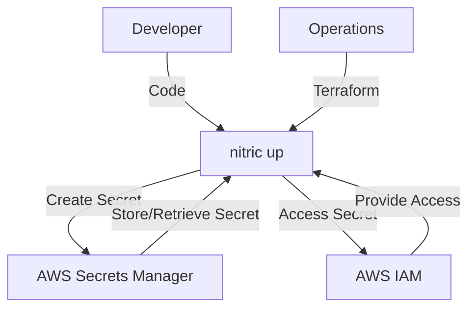
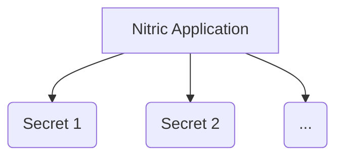

# Nitric 'Secret' Architecture

## 1. System Context (Level 1)

- A **Developer** uses Nitric to manage secrets within their application.
  - App code imports the **Secret resource** from the Nitric SDK.
  - Developers configure secrets and implement application logic to securely access and manage these secrets.
- **Operations** use default or overridden Terraform modules to provision the necessary AWS Secrets Manager resources.
  - **AWS Secrets Manager** stores and manages secrets.
  - **AWS IAM** provides roles/policies for secure access to secrets.



## 2. Container (Level 2)

Each **Secret** is managed through AWS Secrets Manager and is accessed by the application through securely configured mechanisms provided by Nitric.



## 3. Component (Level 3)

### Secrets Module

- **aws_secretsmanager_secret.secret**
  - Creates a new secret in AWS Secrets Manager.
  - Configures the secret name and tags for identification and management.

## 4. Code (Level 4)

**Developers** write application code that imports the 'secret' resource from the SDK, configures the secret, and implements the application logic to access and manage secrets.

```typescript
import { secret } from '@nitric/sdk'

// Define a secret with permission to put a new value
const apiKey = secret('api-key').allow('put')

// Store a new secret value
const latestVersion = await apiKey.put('a new secret value')

// Retrieve the version ID of the newly stored value
console.log(`Secret version ID: ${latestVersion.version}`)
```

**Operations** will use the provided Terraform module to create and manage the AWS Secrets Manager secret as defined.

```hcl
# Create a new AWS Secrets Manager secret
resource "aws_secretsmanager_secret" "secret" {
  name = var.secret_name
  tags = {
    "x-nitric-${var.stack_id}-name" = var.secret_name
    "x-nitric-${var.stack_id}-type" = "secret"
  }
}
```
