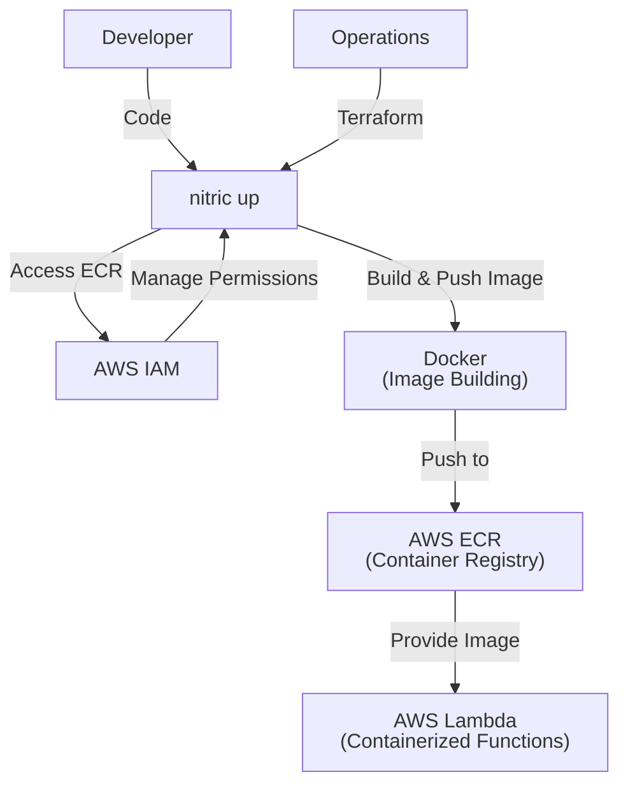
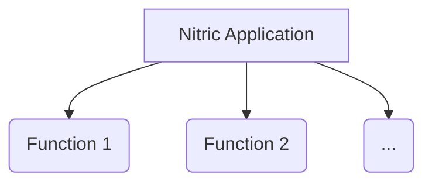

# Nitric 'Service Deployment' Architecture

## 1. System Context (Level 1)

- A **Developer** uses Nitric to deploy and manage serverless functions within their application.
  - App code interacts with the **Service resource** through defined functions.
  - Developers build container images for their Lambda functions and push them to a container registry.
- **Operations** use default or overridden Terraform modules to provision the necessary AWS resources.
  - **AWS ECR (Elastic Container Registry)** stores container images for Lambda functions.
  - **AWS Lambda** runs serverless functions based on the container images.
  - **AWS IAM** manages roles and policies for secure access to AWS resources.
  - **Docker** is used to build and tag container images before pushing them to ECR.



## 2. Container (Level 2)

Each **Service** is containerized, stored in AWS ECR, and deployed using AWS Lambda. The deployment process involves building, tagging, and pushing Docker images to ECR, followed by deploying them as Lambda functions.



## 3. Component (Level 3)

### Lambda Deployment Module

- **terraform `{ required_providers { docker = { source  = "kreuzwerker/docker" version = "3.0.2" } } }`**
  - Configures Terraform to use the Docker provider for managing Docker images and containers.
- **aws_ecr_repository.repo**
  - Creates an AWS ECR repository to store container images for Lambda functions.
- **data.aws_ecr_authorization_token.ecr_auth**
  - Retrieves an authorization token for authenticating Docker with AWS ECR.
- **docker_tag.tag**
  - Tags the provided Docker image with the ECR repository URL.
- **docker_registry_image.push**
  - Pushes the tagged Docker image to the ECR repository.
- **aws_iam_role.role**
  - Creates an IAM role for the Lambda function with a trust relationship allowing Lambda to assume the role.
- **aws_iam_role_policy.resource-list-access**
  - Attaches a custom IAM policy to the Lambda role, granting permissions to list various AWS resources.
- **aws_iam_role_policy_attachment.basic-execution**
  - Attaches the AWSLambdaBasicExecutionRole managed policy to the Lambda role for basic Lambda execution permissions.
- **aws_iam_role_policy_attachment.vpc-access**
  - Conditionally attaches the AWSLambdaVPCAccessExecutionRole managed policy to the Lambda role if VPC subnets are provided.
- **aws_lambda_function.function**
  - Creates a Lambda function using the container image pushed to ECR. Configures environment variables, memory, timeout, and optionally VPC settings.

## 4. Code (Level 4)

**Developers** write application code that implements handlers for the the 'api','bucket','websocket',"topic", "schedule" resources from the SDK.

```typescript
import { api } from '@nitric/sdk'

const customerRoute = api('public').route(`/customers`)

customerRoute.get((ctx) => {
  // construct response for the GET: /customers request...
  const responseBody = {}
  ctx.res.json(responseBody)
})
```

```typescript
import { bucket } from '@nitric/sdk'

const assets = bucket('assets')

const accessibleAssets = bucket('assets').allow('delete')

// The request will contain the name of the file `key` and the type of event `type`
assets.on('delete', '*', (ctx) => {
  console.log(`A file named ${ctx.req.key} was deleted`)
})
```

**Operations** will use the provided Terraform module to create and manage the Service deployment as defined.

```hcl
terraform {
  required_providers {
    docker = {
      source  = "kreuzwerker/docker"
      version = "3.0.2"
    }
  }
}

# Create an ECR repository
resource "aws_ecr_repository" "repo" {
  name = var.service_name
  image_tag_mutability = "IMMUTABLE"
}

data "aws_ecr_authorization_token" "ecr_auth" {
}

# Tag the provided docker image with the ECR repository url
resource "docker_tag" "tag" {
  source_image = var.image
  target_image = aws_ecr_repository.repo.repository_url
}

# Push the tagged image to the ECR repository
resource "docker_registry_image" "push" {
  name = aws_ecr_repository.repo.repository_url
  triggers = {
    source_image_id = docker_tag.tag.source_image_id
  }
}

# Create a role for the lambda function
resource "aws_iam_role" "role" {
  name = var.service_name
  assume_role_policy = jsonencode({
    Version = "2012-10-17"
    Statement = [
      {
        Effect = "Allow"
        Principal = {
          Service = "lambda.amazonaws.com"
        }
        Action = "sts:AssumeRole"
      }
    ]
  })
}

# TODO Make a common policy and attach separately
# as a base common compute policy
resource "aws_iam_role_policy" "resource-list-access" {
  name = "resource-list-access"
  role = aws_iam_role.role.name

  policy = jsonencode({
    Version = "2012-10-17"
    Statement = [
      {
        Effect = "Allow"
        Action = [
          "sns:ListTopics",
          "sqs:ListQueues",
          "dynamodb:ListTables",
          "s3:ListAllMyBuckets",
          "tag:GetResources",
          "apigateway:GET",
        ]
        Resource = "*"
      }
    ]
  })
}


resource "aws_iam_role_policy_attachment" "basic-execution" {
  role       = aws_iam_role.role.name
  policy_arn = "arn:aws:iam::aws:policy/service-role/AWSLambdaBasicExecutionRole"
}

# Attach vpc access execution role if subnets are provided
resource "aws_iam_role_policy_attachment" "vpc-access" {
  count = length(var.subnet_ids) > 0 ? 1 : 0
  role       = aws_iam_role.role.name
  policy_arn = "arn:aws:iam::aws:policy/service-role/AWSLambdaVPCAccessExecutionRole"
}

# Create a lambda function using the pushed image
resource "aws_lambda_function" "function" {
  function_name = "${var.service_name}-${var.stack_id}"
  role          = aws_iam_role.role.arn
  image_uri     = "${aws_ecr_repository.repo.repository_url}@${docker_registry_image.push.sha256_digest}"
  package_type  = "Image"
  timeout = var.timeout
  memory_size = var.memory
  ephemeral_storage {
    size = var.ephemeral_storage
  }
  environment {
    variables = var.environment
  }


  dynamic "vpc_config" {
    for_each = length(var.subnet_ids) > 0 ? ["1"] : []
    content {
      subnet_ids         = var.subnet_ids
      security_group_ids = var.security_group_ids
    }
  }

  depends_on = [docker_registry_image.push]

  tags = {
    "x-nitric-${var.stack_id}-name" = var.service_name,
    "x-nitric-${var.stack_id}-type" = "service",
  }
}
```
