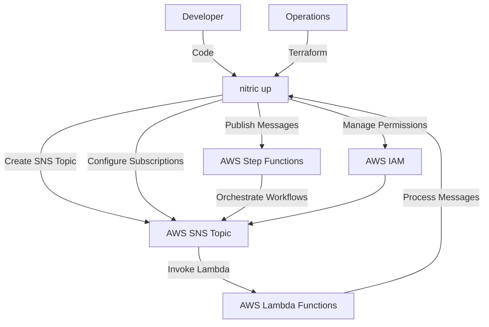
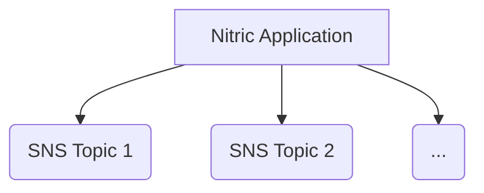

# Nitric 'Topic' Architecture

## 1. System Context (Level 1)

- A **Developer** uses Nitric to manage messaging and event-driven communication within their application.
  - App code interacts with the **SNS Topic resource** through defined topics and subscriptions.
  - Developers configure SNS topics and implement application logic to publish and consume messages.
- **Operations** use default or overridden Terraform modules to provision the necessary AWS SNS resources.
  - **AWS SNS (Simple Notification Service)** serves as the messaging and event notification service.
  - **AWS Lambda** functions are subscribed to SNS topics to process incoming messages.
  - **AWS IAM** manages roles and policies for secure access to SNS topics and Lambda functions.
  - **AWS Step Functions** orchestrate workflows that interact with SNS topics.



## 2. Container (Level 2)

Each **SNS Topic** is managed through AWS SNS and interacts with subscribed AWS Lambda functions and AWS Step Functions to handle event-driven workflows.



## 3. Component (Level 3)

### SNS Topic Module

- **random_id.topic_id**
  - Generates a unique random ID for each SNS topic to ensure unique naming.
- **aws_sns_topic.topic**
  - Creates an AWS SNS topic with a unique name by appending the generated random ID.
  - Configures tags for identification and management.
- **aws_sns_topic_subscription.subscription**
  - Subscribes Lambda functions to the SNS topic.
  - Iterates over `var.lambda_subscribers` to create subscriptions for each Lambda endpoint.
- **aws_lambda_permission.sns**
  - Grants SNS permission to invoke the specified Lambda functions.
  - Iterates over `var.lambda_subscribers` to set permissions for each target function.
- **aws_iam_role.sns_publish_role**
  - Creates an IAM role for AWS Step Functions to publish messages to the SNS topic.
  - Defines a trust relationship allowing Step Functions to assume the role.
- **aws_iam_role_policy.publish_policy**
  - Attaches an inline policy to the SNS publish role, granting permissions to publish messages to the SNS topic.
- **aws_sfn_state_machine.publish_to_topic**
  - Creates an AWS Step Functions state machine that publishes messages to the SNS topic.
  - Defines the workflow with a wait state followed by a publish task.

## 4. Code (Level 4)

**Developers** write application code that imports the 'topic' resource from the SDK, and implements the application logic to publish and subscript to topics.

```typescript
import { topic } from '@nitric/sdk'

const updates = topic('updates').allow('publish')

await updates.publish({
  something: 'amazing happened',
})
```

**Operations** will use the provided Terraform module to create and manage the AWS Secrets Manager secret as defined.

```hcl
# Generate a random id for the topic
resource "random_id" "topic_id" {
  byte_length = 8

  keepers = {
    # Generate a new id each time we switch to a new name
    topic_name = var.topic_name
  }
}


# AWS SNS Topic
resource "aws_sns_topic" "topic" {
  name = "${var.topic_name}-${random_id.topic_id.hex}"

  tags = {
    "x-nitric-${var.stack_id}-name" = var.topic_name
    "x-nitric-${var.stack_id}-type" = "topic"
  }
}

# Loop over the subsribers and deploy subscriptions and permissions
resource "aws_sns_topic_subscription" "subscription" {
  for_each = var.lambda_subscribers

  topic_arn = aws_sns_topic.topic.arn
  protocol  = "lambda"
  endpoint  = each.value
}

resource "aws_lambda_permission" "sns" {
  for_each = var.lambda_subscribers

  action        = "lambda:InvokeFunction"
  function_name = each.value
  principal     = "sns.amazonaws.com"
  source_arn    = aws_sns_topic.topic.arn
}

resource "aws_iam_role" "sns_publish_role" {
  name = "${var.topic_name}-sns-publish-role"

  assume_role_policy = jsonencode({
    Version = "2012-10-17"
    Statement = [
      {
        Effect = "Allow"
        Principal = {
          Service = "states.amazonaws.com"
        }
        Action = "sts:AssumeRole"
      }
    ]
  })
}

# Attach the policy to the role inline
resource "aws_iam_role_policy" "publish_policy" {
  role = aws_iam_role.sns_publish_role.id

  # Terraform's "jsonencode" function converts a
  # Terraform expression result to valid JSON syntax.
  policy = jsonencode({
    Version = "2012-10-17"
    Statement = [
      {
        Effect   = "Allow"
        Action   = "sns:Publish"
        Resource = aws_sns_topic.topic.arn
      }
    ]
  })
}

# Create a step function that publishes to the topic
resource "aws_sfn_state_machine" "publish_to_topic" {
  name     = "${var.topic_name}-publish-to-topic"
  role_arn = aws_iam_role.sns_publish_role.arn
  definition = jsonencode({
    Comment = "",
    StartAt = "Wait",
    States = {
      Wait = {
        Type = "Wait",
        SecondsPath : "$.seconds",
        Next = "Publish"
      }
      Publish = {
        Type     = "Task",
        Resource = "arn:aws:states:::sns:publish",
        Parameters = {
          TopicArn = aws_sns_topic.topic.arn,
          "Message.$" : "$.message",
        },
        End = true
      }
    }
  })
}
```
