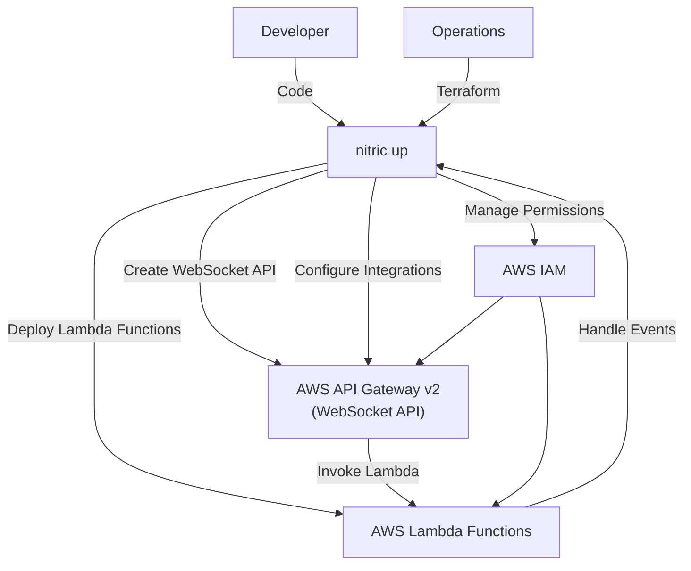
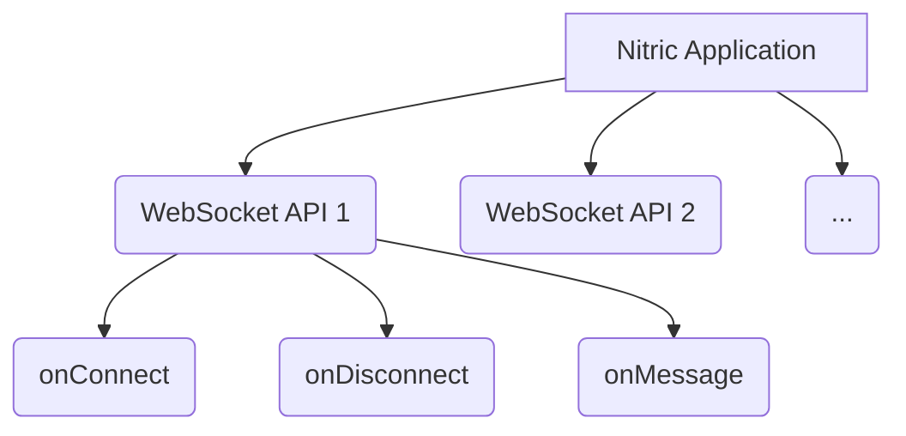

# Nitric 'WebSocket API Gateway' Architecture

## 1. System Context (Level 1)

- A **Developer** uses Nitric to create and manage WebSocket APIs within their application.
  - App code interacts with the **WebSocket API resource** through defined routes and integrations.
  - Developers implement backend logic to handle WebSocket connections, messages, and disconnections.
- **Operations** use default or overridden Terraform modules to provision the necessary AWS WebSocket API resources.
  - **AWS API Gateway v2** manages WebSocket API endpoints and routes.
  - **AWS Lambda** functions handle WebSocket events such as connection, message reception, and disconnection.
  - **AWS IAM** manages roles and policies for secure access between API Gateway and Lambda functions.



## 2. Container (Level 2)

The system comprises AWS API Gateway v2 managing WebSocket APIs, which interact with AWS Lambda functions to handle connection, message, and disconnection events.



## 3. Component (Level 3)

### WebSocket API Module

- **random_id.topic_id**
  - Generates a unique random ID for each SNS topic to ensure unique naming.
- **aws_apigatewayv2_api.websocket**
  - Creates an AWS API Gateway v2 WebSocket API.
  - Configures the API name, protocol type, route selection expression, and tags for identification and management.
- **aws_apigatewayv2_integration.default**
  - Creates an integration for the `$default` route, linking it to a Lambda function.
- **aws_apigatewayv2_integration.connect**
  - Creates an integration for the `$connect` route, linking it to a Lambda function.
- **aws_apigatewayv2_integration.disconnect**
  - Creates an integration for the `$disconnect` route, linking it to a Lambda function.
- **aws_apigatewayv2_route.default**
  - Creates the default route for the WebSocket API, targeting the default integration.
- **aws_apigatewayv2_route.connect**
  - Creates the `$connect` route for the WebSocket API, targeting the connect integration.
  - Depends on the default route to prevent concurrent edit conflicts.
- **aws_apigatewayv2_route.disconnect**
  - Creates the `$disconnect` route for the WebSocket API, targeting the disconnect integration.
  - Depends on the connect route to prevent concurrent edit conflicts.
- **aws_lambda_permission.websocket-message**
  - Grants API Gateway permission to invoke the Lambda function handling messages.
- **aws_lambda_permission.websocket-connect**
  - Grants API Gateway permission to invoke the Lambda function handling connections.
- **aws_lambda_permission.websocket-disconnect**
  - Grants API Gateway permission to invoke the Lambda function handling disconnections.
- **aws_apigatewayv2_stage.stage**
  - Creates a stage for the WebSocket API, enabling automatic deployment of changes.
  - Configures tags for identification and management.

## 4. Code (Level 4)

**Developers** write application code that imports the 'websocket' resource from the SDK and implement backend logic to handle WebSocket connections, messages, and disconnections.

```typescript
import { websocket } from '@nitric/sdk'

const socket = websocket('socket')

socket.on('connect', async (ctx) => {
  // handle connections
})

socket.on('disconnect', async (ctx) => {
  // handle disconnections
})

socket.on('message', async (ctx) => {
  // handle messages
})
```

**Operations** will use the provided Terraform module to create and manage the AWS Secrets Manager secret as defined.

```hcl
#  Deploy a websocket API gateway

resource "aws_apigatewayv2_api" "websocket" {
  name          = var.websocket_name
  protocol_type = "WEBSOCKET"
  route_selection_expression = "$request.body.action"
  tags = {
    "x-nitric-${var.stack_id}-name" = var.websocket_name
    "x-nitric-${var.stack_id}-type" = "websocket"
  }
}

resource "aws_apigatewayv2_integration" "default" {
  api_id           = aws_apigatewayv2_api.websocket.id
  integration_type = "AWS_PROXY"
  integration_uri  = var.lambda_message_target
}

# Create an integration for the connect route
resource "aws_apigatewayv2_integration" "disconnect" {
  api_id           = aws_apigatewayv2_api.websocket.id
  integration_type = "AWS_PROXY"
  integration_uri  = var.lambda_disconnect_target
}

# Create an integration for the connect route
resource "aws_apigatewayv2_integration" "connect" {
  api_id           = aws_apigatewayv2_api.websocket.id
  integration_type = "AWS_PROXY"
  integration_uri  = var.lambda_connect_target
}

# Create the default route for the websocket
resource "aws_apigatewayv2_route" "default" {
  api_id    = aws_apigatewayv2_api.websocket.id
  route_key = "$default"
  target    = "integrations/${aws_apigatewayv2_integration.default.id}"
}

# Create the connect route for the websocket
resource "aws_apigatewayv2_route" "connect" {
  api_id    = aws_apigatewayv2_api.websocket.id
  route_key = "$connect"
  target    = "integrations/${aws_apigatewayv2_integration.connect.id}"
  # Chain routes to prevent Concurrent edit conflict exceptions
  depends_on = [ aws_apigatewayv2_route.default ]
}

# Create the disconnect route for the websocket
resource "aws_apigatewayv2_route" "disconnect" {
  api_id    = aws_apigatewayv2_api.websocket.id
  route_key = "$disconnect"
  target    = "integrations/${aws_apigatewayv2_integration.disconnect.id}"
  # Chain routes to prevent Concurrent edit conflict exceptions
  depends_on = [ aws_apigatewayv2_route.connect ]
}

# Create execution lambda permissions for the websocket
resource "aws_lambda_permission" "websocket-message" {
  action        = "lambda:InvokeFunction"
  function_name = var.lambda_message_target
  principal     = "apigateway.amazonaws.com"
  source_arn    = "${aws_apigatewayv2_api.websocket.execution_arn}/*/*"
}

resource "aws_lambda_permission" "websocket-connect" {
  action        = "lambda:InvokeFunction"
  function_name = var.lambda_connect_target
  principal     = "apigateway.amazonaws.com"
  source_arn    = "${aws_apigatewayv2_api.websocket.execution_arn}/*/*"
}

resource "aws_lambda_permission" "websocket-disconnect" {
  action        = "lambda:InvokeFunction"
  function_name = var.lambda_disconnect_target
  principal     = "apigateway.amazonaws.com"
  source_arn    = "${aws_apigatewayv2_api.websocket.execution_arn}/*/*"
}

# create a stage for the api gateway
resource "aws_apigatewayv2_stage" "stage" {
  api_id      = aws_apigatewayv2_api.websocket.id
  name        = "ws"
  auto_deploy = true

  tags = {
    "x-nitric-${var.stack_id}-name" = "${var.websocket_name}DefaultStage"
    "x-nitric-${var.stack_id}-type" = "websocket"
  }
}
```
