## What we'll be doing

In this guide, we'll walk through the steps of getting started with [Nitric Deploy](https://deploy.nitric.io). You'll deploy a new project in just a few minutes.

1. Sign in to Nitric Deploy
2. Create an organization
3. Set up AWS credentials
4. Create or import a project
5. Create an environment
6. Configure environment variables
7. Deploy your project
8. View the logs

## Sign in to Nitric Deploy

> [Nitric Deploy](https://deploy.nitric.io) is currently in preview. You can sign up for access using your GitHub account.

Nitric Deploy can be accessed by navigating to https://deploy.nitric.io - you'll be greeted by our sign-in screens. Follow the prompts to sign in with GitHub.

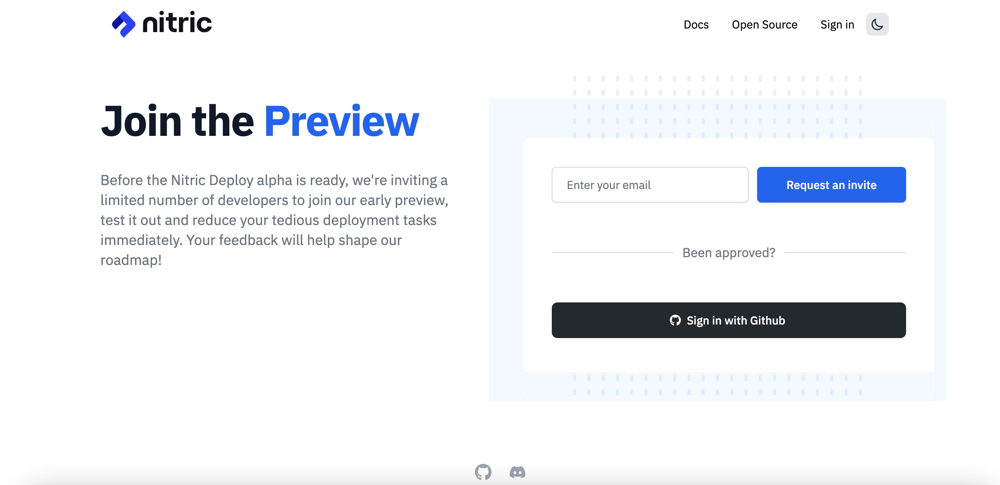

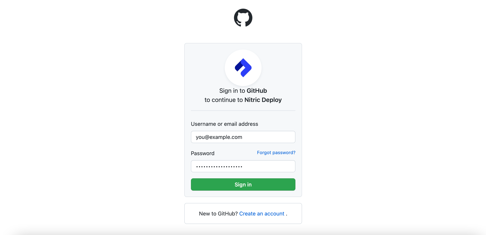

## Create an organization

Organizations allow you to group your projects. For example, I have an organization that contains all of my demo projects.

Let's create a new organization and give it a name.

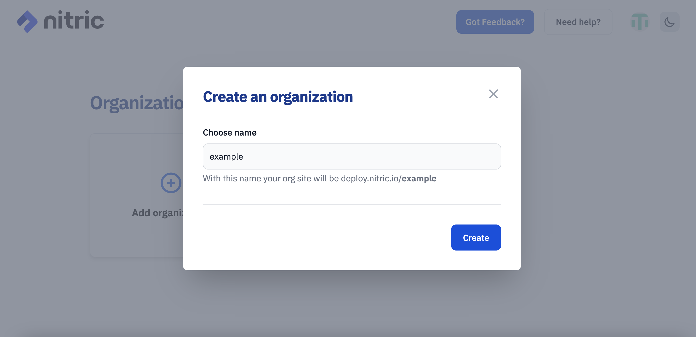

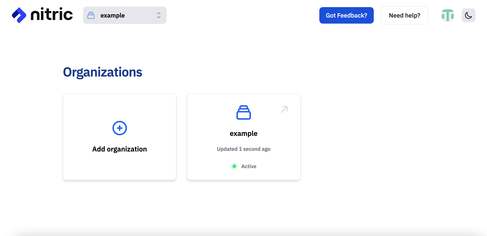

## Set up AWS credentials

The next step is to set up our AWS credentials with our new organization. Navigate to Settings -> Credentials and click **Create Credential**.

You'll need to name and store your AWS credentials.

> If you're unsure about what these are or how to get them, see the [Understanding and getting your AWS credentials](https://docs.aws.amazon.com/general/latest/gr/aws-sec-cred-types.html) documentation from AWS.

> Only valid credentials will work here.

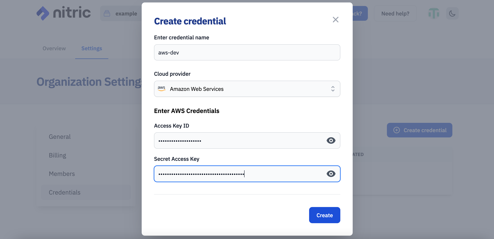

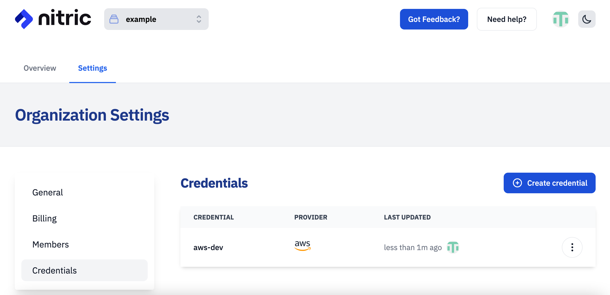

## Create or import a project

Projects can be imported from existing Git repositories or we can scaffold a new project for you from one our of templates.

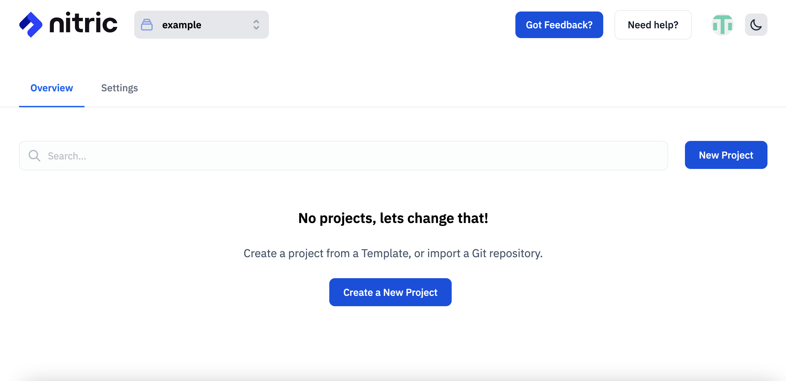

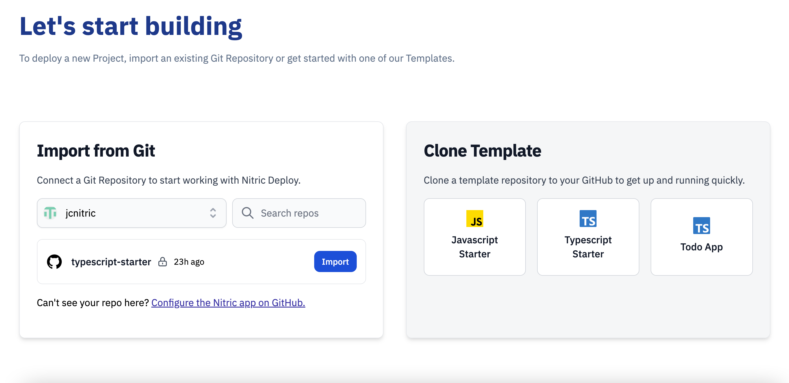

### Existing projects

In order to import an existing project, it must have been scaffolded by using the Nitric CLI. Your projects _must_ contain a valid `nitric.yaml` file for it to function correctly.

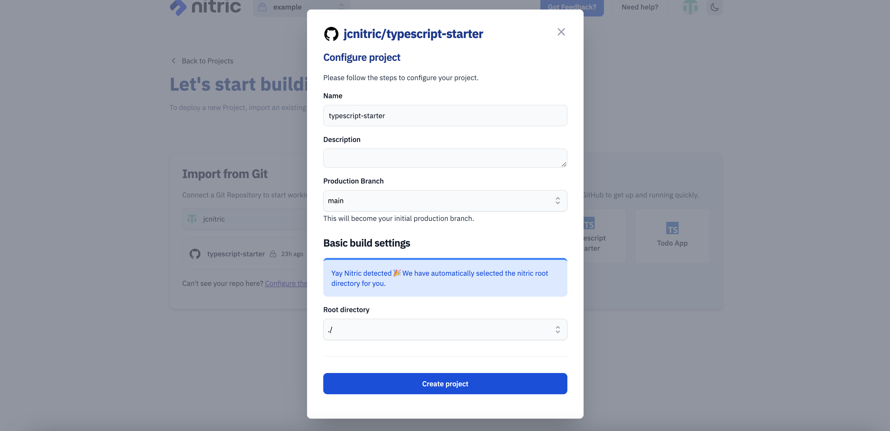

### Scaffold a new project

Our template projects will give you a starting point with a basic REST API.

> Your new project will be scaffolded in the repository you select.

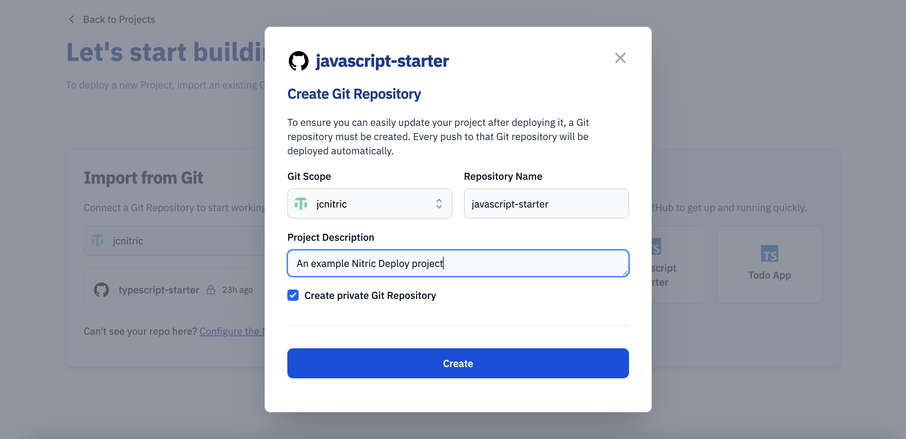

In both of the scenarios, you'll need to choose a production branch. This is the branch Nitric Deploy watches for any push events and triggers a deployment.

You'll also need to specify which directory the Nitric source code is in - by default this would be the root directory `./` but could be a few levels deeper if you are working in an existing monorepo.

## Configure environment variables

If your project requires variables, they can be added in project settings.

> Changes to variables will require a redeploy, which can be triggered from the project's home.

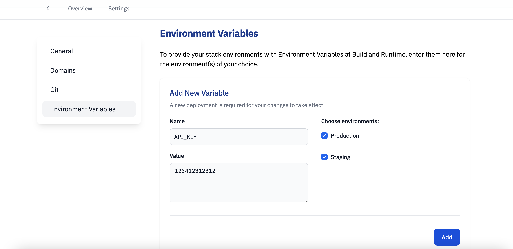

## Create an environment

An environment represents a deployed instance of your application in a specific AWS account and region. You can have one or more environments based on the development workflow you follow (e.g. dev, staging, prod), or if you need environments in other regions or using different credentials.

> Once you've created an environment, Nitric Deploy will automatically initiate your first cloud deployment.

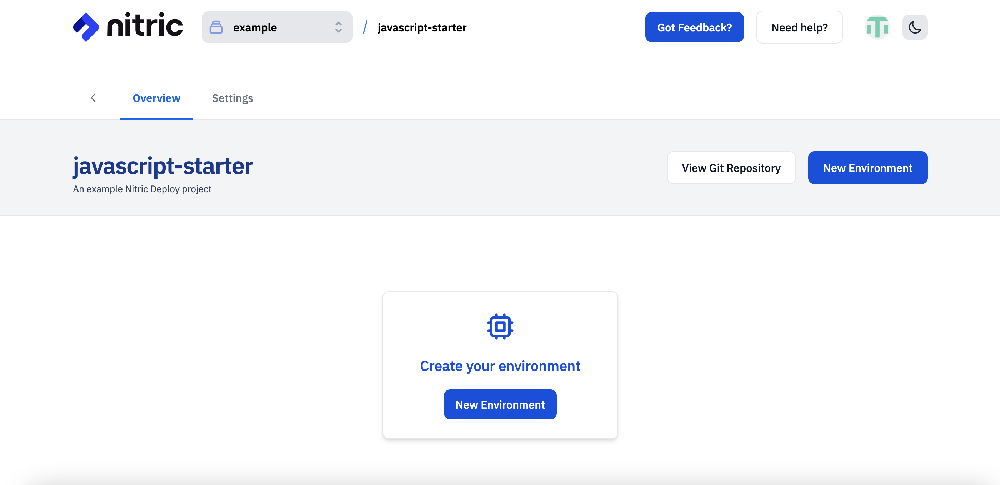

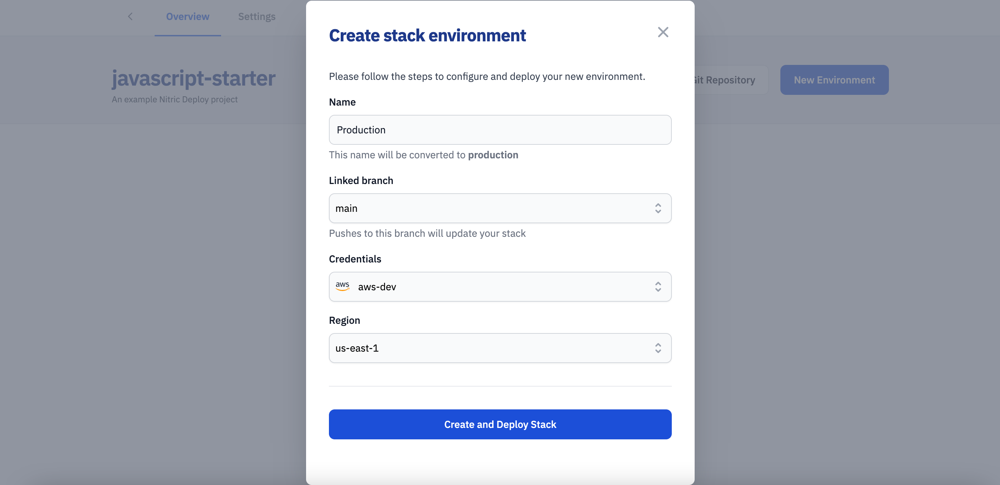

## Deploy your project

Your project will automatically deploy when you create your environment for the first time, and the right cloud infrastructure will be automatically provisioned. It will also deploy each time you push to the `linked branch` selected when creating your environment.

Once you see the deployment tick over to success with a 'tick' you'll also notice that your preview/production URL is displayed. You can use this to access your deployed API.

If you scaffolded a template project then you can test the API out with the following command.

```bash
curl https://{url}/hello/user
```

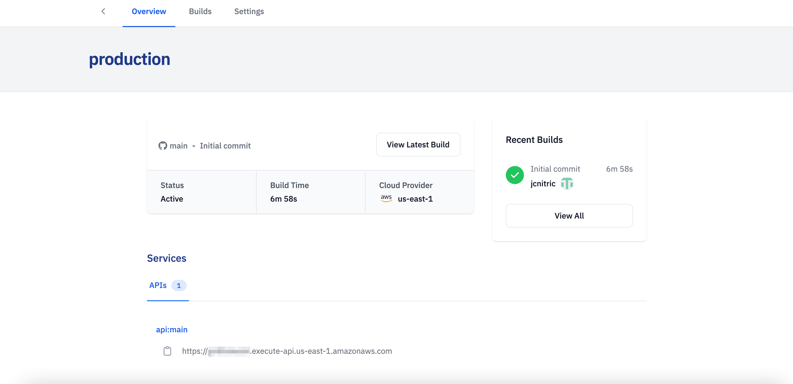

## View the logs

By clicking on 'view latest build' we can see the details and retrieve the deployment log information.

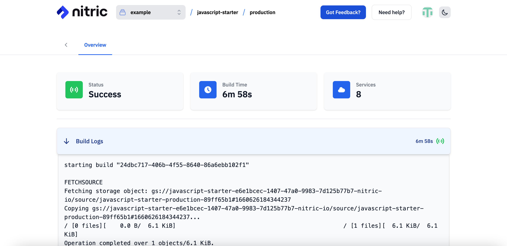

That's it! With just a few clicks, you've deployed a project to your cloud and don't have to manage environments or infrastructure state.

## What's next?

Try one of the following activities to keep going with Nitric:

- Update your code and push it to the configured branch
- Get started on one of our [guides](/docs/reference) to build a new project with the Nitric CLI
- [Join our Discord](https://discord.gg/Webemece5C) to ask questions or get help with your next project
