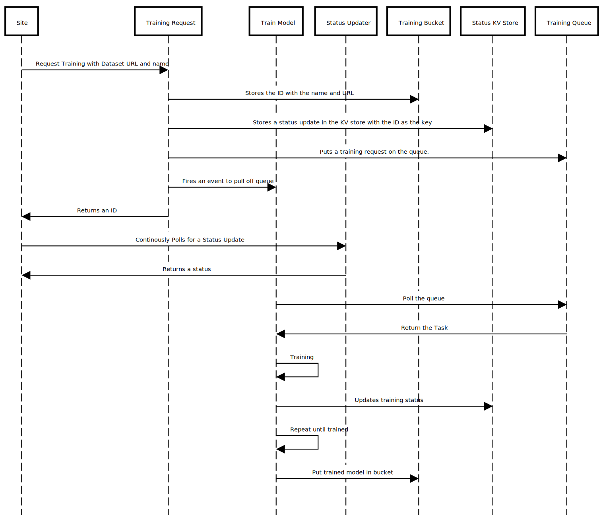
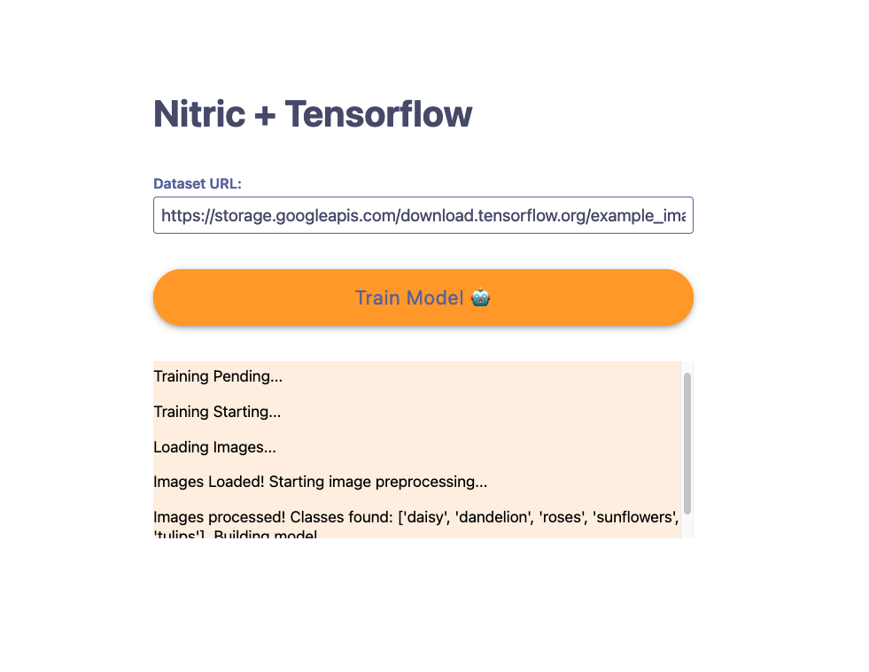

## Introduction

TensorFlow is an open source platform for machine learning. It has a flexible libary of tools and an active community which enables developers of ML to easily build and deploy ML applications. Combining this power with the Nitric framework, we can build a tensorflow image classifier efficiently, that can be distributed to any cloud.

For this tutorial you will require Node. To check if you have Node installed, run this command in your terminal:

```bash
node -v
```

If Node is installed, it should produce a version number like `v14.16.0`. You will also require python and pip.

```bash
python -m pip --version
```

If python and pip are installed, it will produce 'pip 21.1.3 from /where/pip/is/installed'

It is also assumed that you have already installed the Nitric CLI. If not visit the [installation instructions](../getting-started/installation.mdx).

## Project set up

For this project we will make a simple website where a dataset url can be inputted to train an image classifier remotely using the Nitric framework and tensorflow.

Using the Nitric CLI we start by creating the project.

```bash
nitric make:stack nitric-image-classifier
```

Next we'll be asked what template to use. We can pick any of them, because we'll delete most of the boilerplate anyways.

```bash
? Service template (Use arrow keys)
❯ official/TypeScript Stack
  official/Python Stack
  official/Java Stack
  official/Go Stack
```

Start by deleting the `common` folder, the files in the `functions` folder, `api.yaml`, and the contents after the name key in `nitric.yaml`.

The project structure should now look like this:

```
nitric-image-classifier
|-- functions/
|-- .gitignore
|-- nitric.yaml
|-- package.json
|-- yarn.lock
```

And the `nitric.yaml` file should now look like:

```yaml
name: nitric-image-classifier
```

### Understanding the structure

For this project we will need a site and 3 services: one responsible for requesting training, one responsible for training, and one responsible for updating the site status.

We will build the site in a later step, but for now build the services using the `nitric make:service` command.

```bash
nitric make:service
? Service template function/nodets12
? Service name training-requester
✔ Making Service training-requester
```

```bash
nitric make:service
? Service template function/nodets12
? Service name status-updater
✔ Making Service status-updater
```

```bash
nitric make:service
? Service template function/python37
? Service name train-model
✔ Making Service train-model
```

Make sure the project structure looks like so:

```
nitric-image-classifier
|-- functions/
|   |-- status-updater.ts
|   |-- train-model.py
|   |-- training-requester.ts
|-- .gitignore
|-- nitric.yaml
|-- package.json
|-- requirements.txt
|-- yarn.lock
```

The site starts the communication, by calling the `training requester` service to make a model with the specified dataset. The requester will return an ID, and it is the sites responsiblity to maintain that ID for when accessing the model and its training status. The flow of communication looks like so:



As seen in the sequence diagram, the project will also require a bucket, document and queue. It will also need to publish an event between the `training-requester` and the `train-model` functions. These are simply added in the `nitric.yaml` file, as seen below:

```yaml
name: nitric-image-classification
functions:
  train-model:
    handler: functions/train-model
    triggers:
      topics:
        - new-model
  training-requester:
    handler: functions/training-requester
  status-updater:
    handler: functions/status-updater
topics:
  new-model: {}
buckets:
  datasets: {}
queues:
  training-queue: {}
```

The above changes sets up a bucket, topic, and queue. The function `train-model` will also be updated to be subscribed to the `new-model` topic. This means that when the `training-requester` fires an event, the `train-model` function will be listening waiting for that topic to be updated.

## Building the Services

### Building the Model Training

For this service we set up a simple image classification model using tensorflow.

Throughout the training process there will be status logs pushed to a collection with the name as the id. When the status is updated, the most recent document will be returned and then deleted. This means it will be first in first out ordering for the status log. The names for the documents don't matter as long as they are unique.

```python
# index.py
import tensorflow as tf
import pathlib
from tensorflow import keras
from tensorflow.keras import layers
from tensorflow.keras.models import Sequential
from nitric.faas import start, Trigger
from nitric.api import Storage, Queues, Task, Documents

async def trainNewModel(id, dataset_url):
    updates = Documents().collection(id)

    file_name = dataset_url.split('/')[-1].split('.')[0]
    await updates.doc("3").set({ "update": "Loading Images..." })
    data_dir = tf.keras.utils.get_file(fname=file_name, origin=dataset_url, untar=True, cache_dir="nitric", cache_subdir="buckets/datasets")
    await updates.doc("4").set({ "update": "Images Loaded! Starting image preprocessing..." })
    data_dir = pathlib.Path(data_dir)

    batch_size = 32
    img_height = 180
    img_width = 180

    train_ds = tf.keras.preprocessing.image_dataset_from_directory(
        data_dir,
        validation_split=0.2,
        subset="training",
        seed=123,
        image_size=(img_height, img_width),
        batch_size=batch_size)

    val_ds = tf.keras.preprocessing.image_dataset_from_directory(
        data_dir,
        validation_split=0.2,
        subset="validation",
        seed=123,
        image_size=(img_height, img_width),
        batch_size=batch_size)

    class_names = train_ds.class_names
    await updates.doc("5").set({ "update": "Images processed! Classes found: %s. Building model..."%class_names })

    AUTOTUNE = tf.data.AUTOTUNE

    train_ds = train_ds.cache().shuffle(1000).prefetch(buffer_size=AUTOTUNE)
    val_ds = val_ds.cache().prefetch(buffer_size=AUTOTUNE)

    num_classes = len(class_names)

    model = Sequential([
        layers.experimental.preprocessing.Rescaling(1./255, input_shape=(img_height, img_width, 3)),
        layers.Conv2D(16, 3, padding='same', activation='relu'),
        layers.MaxPooling2D(),
        layers.Conv2D(32, 3, padding='same', activation='relu'),
        layers.MaxPooling2D(),
        layers.Conv2D(64, 3, padding='same', activation='relu'),
        layers.MaxPooling2D(),
        layers.Dropout(0.2),
        layers.Flatten(),
        layers.Dense(128, activation='relu'),
        layers.Dense(num_classes)
    ])

    await updates.doc("6").set({ "update": "Model Built! Compiling..." })
    model.compile(optimizer='adam',
                    loss=tf.keras.losses.SparseCategoricalCrossentropy(from_logits=True),
                    metrics=['accuracy'])

    await updates.doc("7").set({ "update": "Model Compiled! Training model..." })
    epochs = 1
    model.fit(
        train_ds,
        validation_data=val_ds,
        epochs=epochs
    )
    await updates.doc("8").set({ "update": "Training Complete! Saving model..." })
    model.save('trained_model.h5')
    saved_model = open('trained_model.h5', 'rb')
    storage_client = Storage()
    model_bytes = saved_model.read()
    await storage_client.bucket('datasets').file(id + '-model.h5').write(model_bytes)
    await updates.doc("9").set({ "update": "Model Saved!" })
```

### Building the Training Requester

The training requester takes a dataset URL and returns a unique ID. It uses this ID as an identifier for the other services to access the correct storage and the correct status logs.

On a request to this service it will write the dataset URL to a bucket with the ID as a prefix. It will then write a status update to the Document collection with the id as the collection name. It then pushes a new task to the `training-queue` and finally fires an event to the `train-model` service to poll the queue.

```ts
//index.ts
import { faas, Storage, Documents, Queueing, Eventing } from '@nitric/sdk';

interface TrainingRequest {
  dataset_name: string;
  dataset_url: string;
}

// Start your function here
faas.start(
  async (request: faas.NitricTrigger<TrainingRequest>): Promise<string> => {
    const { dataset_url } = request.dataAsObject();
    const id = uuid();

    //Write information to bucket
    const storage_client = new Storage();
    await storage_client
      .bucket('datasets')
      .file(`${id}-url`)
      .write(Buffer.from(dataset_url));

    //Write to Document
    const documents = new Documents().collection(id);
    documents.doc('1').set({ update: 'Training pending...' });

    //Send task to queue
    const trainingQueue = new Queueing().queue('training-queue');
    await trainingQueue.send({ id: id });

    const event_client = new Eventing();
    event_client.topic('new-model').publish({
      id: id,
      payload: {
        value: 'Train new model please :)',
      },
    });

    return id;
  }
);

//Get uuid utility function
function uuid(): string {
  function func() {
    return (((1 + Math.random()) * 0x10000) | 0).toString(16).substring(1);
  }
  return (
    func() +
    func() +
    '-' +
    func() +
    '-3' +
    func().substr(0, 2) +
    '-' +
    func() +
    '-' +
    func() +
    func() +
    func()
  ).toLowerCase();
}
```

### Building the Status Updater

Finally, we will write the status updater. This function takes an ID when it receives a request and will return the latest status from the document collection with the same ID.

```ts
//index.ts
import { faas, Documents } from '@nitric/sdk';

interface StatusRequest {
  id: string;
}

//Returns the latest status
faas.start(
  async (trigger: faas.NitricTrigger<StatusRequest>): Promise<string> => {
    const { id } = trigger.dataAsObject();
    const document = new Documents();
    const doc = await document.collection(id).query().fetch();
    //If the document exists, delete it and return its contents
    if (doc.documents[0]) {
      console.log(doc.documents[0]);
      await document.collection(id).doc(doc.documents[0].id).delete();
      return doc.documents[0].content['update'];
    }
    return '';
  }
);
```

## Building the site

The site will be a simple form that accepts a dataset url and a button to submit the training request. It will then have a field where the status is updated. We will create a folder called `training-site` with an `index.html` and an `index.js`.

One optional step is to add a CSS file `index.css` to make our app look beautiful. You can find the full contents of this file <a href="https://raw.githubusercontent.com/nitrictech/docs/main/assets/tutorial-styles.css" target="_blank" rel="noopener noreferrer">here.</a>

Once this has been added, the site needs to be registered as part of the Nitric stack. This is simply done by going to the `nitric.yaml` file and adding a site.

```yaml
sites:
  training-site:
    path: training-site
    assetPath: ./
```

We will then start writing our website code.

```html
<!--index.html-->
<!DOCTYPE html>
<html>
  <head>
    <meta charset="utf-8" />
    <meta http-equiv="X-UA-Compatible" content="IE=edge" />
    <meta name="viewport" content="width=device-width, initial-scale=1.0" />
    <title>ML Models</title>
    <link rel="stylesheet" type="text/css" href="index.css" media="screen" />
  </head>
  <body>
    <div class="center">
      <div class="container grid">
        <h1>Nitric + Tensorflow</h1>
        <div class="field">
          <label for="dataset_url">Dataset URL:</label>
          <input
            id="dataset_url"
            type="text"
            value="https://storage.googleapis.com/download.tensorflow.org/example_images/flower_photos.tgz"
          />
        </div>
        <button class="primary" id="train">
          Train Model
          <div class="loader">🤖</div>
        </button>
        <div
          style="background-color: #fcefde; height: 150px; overflow: scroll; overflow-x: hidden;"
          id="status-section"
        >
          <p style="font-size: 1.1rem;" id="status-update"></p>
        </div>
      </div>
    </div>
    <script src="index.js"></script>
  </body>
</html>
```

The `index.js` file will handle making a request, and then awaiting status updates.

First we will write a function that is called when a request is made for a model to be trained. This function will make a POST request to the `training-requester` service with the dataset URL the user has provided, and recieves a response containing an ID. This ID is then used when polling for the current status of that model.

```js
//index.js
async function trainModel() {
  var datasetUrl = document.getElementById('dataset_url').value;
  //Make sure the inputs aren't null or empty
  if (!datasetUrl) {
    alert('Dataset URL must be provided');
    return;
  }
  //Make call to train
  try {
    const rawResponse = await fetch('/train/', {
      method: 'POST',
      body: JSON.stringify({
        dataset_url: datasetUrl,
      }),
    });
    awaitStatus(await rawResponse.text());
  } catch (error) {
    alert(error.message);
  }
}
document.getElementById('train').addEventListener('click', trainModel);
```

The second function `awaitStatus` is in a loop, that polls that status update every second. This can be lowered for more frequent polling, but increases the amount the `status-updater` service will be requested. The function makes a HTTP request, with the id, to the status updater. It responds with the status update, and then appends this to the status section of the site if this is a new update.

```js
//index.js
const waitFor = (delay) => new Promise((resolve) => setTimeout(resolve, delay));

async function awaitStatus(id) {
  const statusForm = document.getElementById('status-section');
  while (true) {
    await waitFor(2000);
    const statusUpdate = await fetch('/status/', {
      method: 'POST',
      body: JSON.stringify({
        id: id,
      }),
    });
    const statusText = await statusUpdate.text();
    const status = document.getElementById('status-update');
    if (statusText !== '' && status.innerHTML !== statusText) {
      status.id = '';
      const newStatus = document.createElement('p');
      newStatus.innerHTML = statusText;
      newStatus.id = 'status-update';
      newStatus.className = 'status-message';
      statusForm.appendChild(newStatus);
    }
    if (statusText === 'Model Trained!') {
      break;
    }
  }
}
```

### Setting up the Entrypoints

For each of our services, we want an entrypoint that is relative to the site. This functionality is added in the `nitric.yaml` file by using the entrypoints key. We don't need an entrypoint for the `train-model` service as that is triggered via its topic subscription.

```yaml
entrypoints:
  main:
    paths:
      /:
        target: functions/training-site
        type: site
      /train/:
        target: functions/training-requester
        type: function
      /status/:
        target: functions/status-updater
        type: function
```

### Launch!

Now that we have all the logic in place, we can run our app:

```bash
nitric run
```

And then click and open the `main` entrypoint localhost url and you should see the completed app:

```bash
✔ Starting Entrypoints
 Service            Port
 ────────────────── ─────
 status-updater     49152
 train-model        49153
 training-requester 49154
 Entrypoint Url
 ────────── ──────────────────────
 main       http://localhost:63562
```


