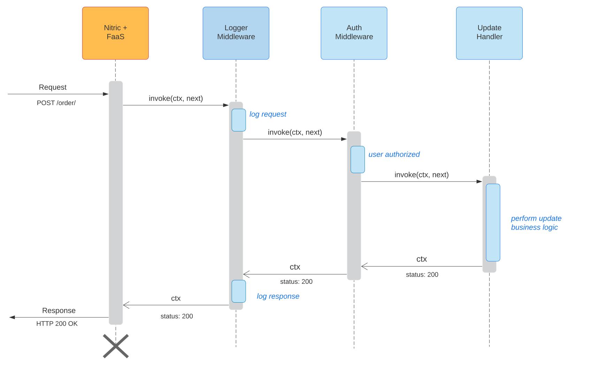
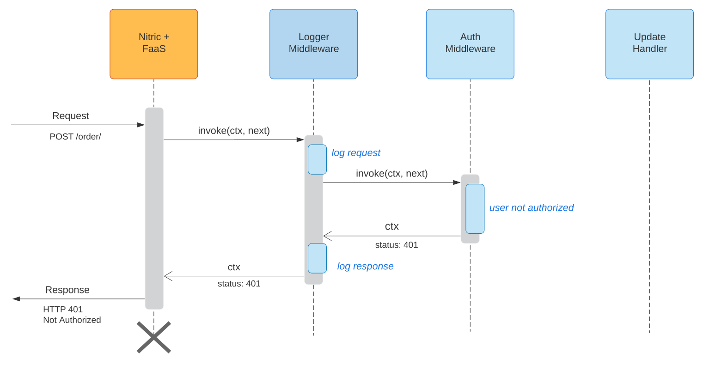

Nitric provides a powerful FaaS Middleware framework for creating applications.

If you haven't used Middleware before, its a design pattern popularized by JavaScript frameworks such as [Express](https://expressjs.com/) and [Koa](https://koajs.com/). While in the Java space the JEE Servlet Filters actually use the middleware pattern.

Before diving into the FaaS middleware features, lets first take a look handlers which provide a simple way to get started with Nitric.

### Handlers

Handlers provided a simple functional interface for writing event/http handling code.

<CodeExamples
	languages={[
	{
		label: "Node",
		value: "node"
	},
	{
		label: "Python",
		value: "python"
	},
	{
		label: "Java",
		value: "java"
	},
	{
		label: "Go",
		value: "go"
	}
	]}
	defaultLang="node"
>
<CodeExample lang="node">

```typescript
import { faas } from '@nitric/sdk';

faas
  .http(async (ctx: faas.HttpContext): Promise<faas.HttpContext> => {
    ctx.res.body = 'Hello World!';

    return ctx;
  })
  .start();
```

</CodeExample>
<CodeExample lang="python">

```python
from nitric.faas import HttpContext, start


async def handler(ctx: HttpContext) -> HttpContext:
  ctx.res.body = b'Hello World!'
  return ctx


if __name__ == "__main__":
  start(handler)
```

</CodeExample>
<CodeExample lang="java">

```java
package example.hello;

import io.nitric.faas.Faas;
import io.nitric.faas.http.HttpContext;
import io.nitric.faas.http.HttpHandler;

public class HelloHandler implements HttpHandler {

    public HttpContext handle(HttpContext ctx) {
        ctx.getResponse().data("Hello World!")

        return ctx;
    }

    public static void main(String[] args) {
        new Faas()
            .http(new HelloHandler())
            .start();
    }
}
```

</CodeExample>
<CodeExample lang="go">

```go
package main

import (
	"fmt"

	"github.com/nitrictech/go-sdk/faas"
)

func handler(ctx *faas.HttpContext) (*faas.HttpContext, error) {
	ctx.Response.Body = []byte("Hello World!")

	return ctx, nil
}

func main() {
	err := faas.New().Http(
		handler,
	).Start()

	if err != nil {
		fmt.Println(err)
	}
}
```

</CodeExample>
</CodeExamples>

In the examples above the `ctx` object provides access to the request and response objects. When you start a `faas` it connects with the Nitric Membrane and is then ready to start processing requests with your handler function.

## Middleware Concepts

The middleware pattern allows you to build event processing pipelines using middleware components. Each middleware:

- can choose whether to pass the event to the next middleware in the pipeline
- can perform work before and after the next middleware in the pipeline is invoked

The FaaS middleware contracts are outlined below. Note the `next` middleware parameter, which is the next middleware in the chain to be invoked.

<CodeExamples
	languages={[
	{
		label: "Node",
		value: "node"
	},
	{
		label: "Python",
		value: "python"
	},
	{
		label: "Java",
		value: "java"
	},
	{
		label: "Go",
		value: "go"
	}
	]}
	defaultLang="node"
>
<CodeExample lang="node">

```typescript
export type GenericMiddleware<Ctx> = (
  ctx: Ctx,
  next?: GenericHandler<Ctx>
) => Promise<Ctx> | Ctx;

export type HttpMiddleware = GenericMiddleware<HttpContext>;
export type EventMiddleware = GenericMiddleware<EventContext>;
```

</CodeExample>
<CodeExample lang="python">

```python
TODO...
```

</CodeExample>
<CodeExample lang="java">

```java
public EventContext handle(EventContext ctx, EventMiddleware);

public HttpContext handle(HttpContext ctx, HttpMiddleware);
```

</CodeExample>
<CodeExample lang="go">

```go
func handler(ctx *faas.EventContext, next faas.EventHandler) (*faas.EventContext, error)

func handler(ctx *faas.HttpContext, next faas.HttpHandler) (*faas.HttpContext, error)
```

</CodeExample>
</CodeExamples>

A FaaS middleware request processing pipeline is illustrated below.



This middleware pipeline/chain is composed of:

- `LoggerMiddleware` performing SEIM logging of the request
- `AuthMiddleware` performing user authentication and authorization
- `UpdateHandler` performs business logic updating Order document

Middleware can abort further processing by simply not calling the next middleware in the chain. In the sequence diagram below the `AuthMiddleware` determines the user is not authorized, it skips calling the next middleware and returns a HTTP 401 status.



Another important use of middleware is processing requests and augmenting them with additional information which subsequent middleware can use. Examples of this include:

- marshalling request data into typed objects
- parsing URL paths into path parameters
- adding user profile data to a request

Middlewares should be loosely coupled enabling reuse and highly composable software.

## Examples

To see more fully featured middleware examples review the code generated with the Nitric CLI project stack templates.

```bash
$ nitric-dev make:stack myproj
```
