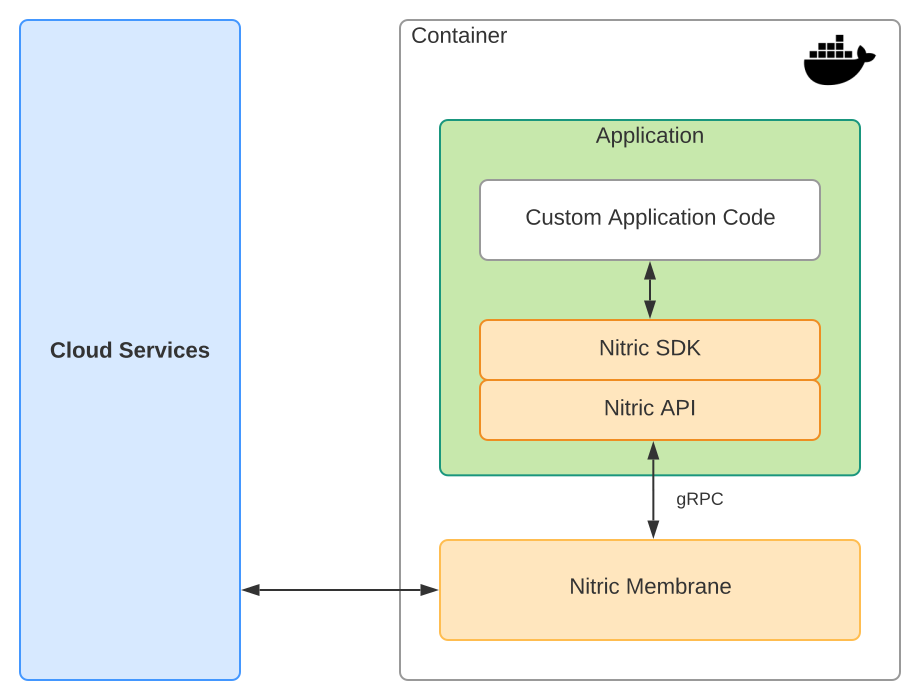

Nitric is an open framework designed to support additional languages for multi-cloud development. Languages are supported through SDKs which provide Nitric APIs to cloud services and a FaaS micro-framework to build cloud functions.

If you want add support for another language please contribute to the [GitHub Nitric](https://github.com/nitrictech) open source project. Please reach out to us, we would will be super happy to help.

## Building SDKs

Nitric language SDKs are layered with 2 parts:

1. API library which contains generated gRPC code (base Nitric API)
2. SDK library which provides a FaaS micro-framework and higher level Fluent Nitric API on top of the base Nitric API

[gPRC](https://grpc.io/) is used to provide APIs with native language support and high performance.

Application code uses SDKs Nitric APIs to call cloud services via the Nitric Membrane.

Currently supported Nitric language APIs and SDKs are provided below:

| Node                                                             | Python                                                               | JVM                                                            | Go                                                           |
| ---------------------------------------------------------------- | -------------------------------------------------------------------- | -------------------------------------------------------------- | ------------------------------------------------------------ |
| [Node API](https://github.com/nitrictech/apis/tree/develop/node) | [Python API](https://github.com/nitrictech/apis/tree/develop/python) | [JVM API](https://github.com/nitrictech/apis/tree/develop/jvm) | [Go API](https://github.com/nitrictech/apis/tree/develop/go) |
| [Node SDK](https://github.com/nitrictech/node-sdk)               | [Python SDK](https://github.com/nitrictech/python-sdk)               | [JVM SDK](https://github.com/nitrictech/java-sdk)              | [Go SDK](https://github.com/nitrictech/go-sdk)               |

To add new language support we would recommend you follow the same layering pattern with a generated gRPC base API library and a separate SDK repository which provides a higher level language support developers to use.

## Nitric API gRPC Proto Contracts

The [Nitric](https://github.com/nitrictech/nitric) repository maintains the Service API [Proto Contracts](https://github.com/nitrictech/nitric/tree/develop/contracts).

Anytime a Nitric proto contract change is made a GitHub workflow action executes for each lanaguage API which:

1. generates gRPC library code an increments the version
2. publishes the new API library to the respective language package/distro manager

Language SDK developers should then update and test their SDKs with a new API library version and publish it to the appropriate language package/repository.
