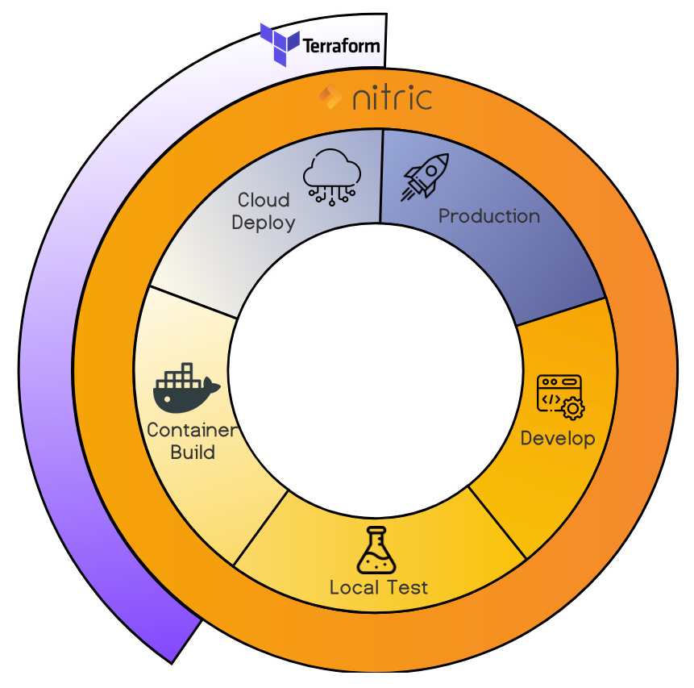

Terraform is a powerful cloud deployment "Infrastructure as Code" (IaC) toolset. Terraform was created as an open-source project by HashiCorp. With Terraform, users define and provide data centre infrastructure using a declarative configuration language known as HashiCorp Configuration Language (HCL).

Nitric in comparison provides a higher level FaaS application development framework and IaC deployment toolset for multi-cloud software development.

The diagram below illustrates the relative coverage of Nitric and Terraform in mutli-cloud software development.

Within Infrastructure as Code (IaC) space where there is some overlap between Nitric and Terraform, the Nitric stack definition provides a high-level application concept. Nitric is able to infer the intent of the application and provision the correct resources and permissions for each Cloud Vendor.

With Terraform in comparison, developers have to explicitly define the Cloud Vendor's specific low-level resources and permissions to enable the solution stack to function.

## Feature Comparison

| **Feature**                          | **Nitric** | **Terraform** |
| ------------------------------------ | ---------- | ------------- |
| Open Source                          | Yes        | Yes           |
| Infrastructure as Code (IaC)         | Yes        | Yes           |
| Stack / resource definition format   | YAML       | HCL           |
| Cloud agnostic definitions           | Yes        | Somewhat      |
| Supported Cloud Providers            | 4          | 8             |
| CLI                                  | Yes        | Yes           |
| Membrane multi-cloud gateway/adaptor | Yes        | -             |
| Multi-cloud API                      | Yes        | -             |
| FaaS micro-framework                 | Yes        | -             |
| Dev Languages supported              | 4          | -             |
| Dev Language project scaffolding     | Yes        | -             |
