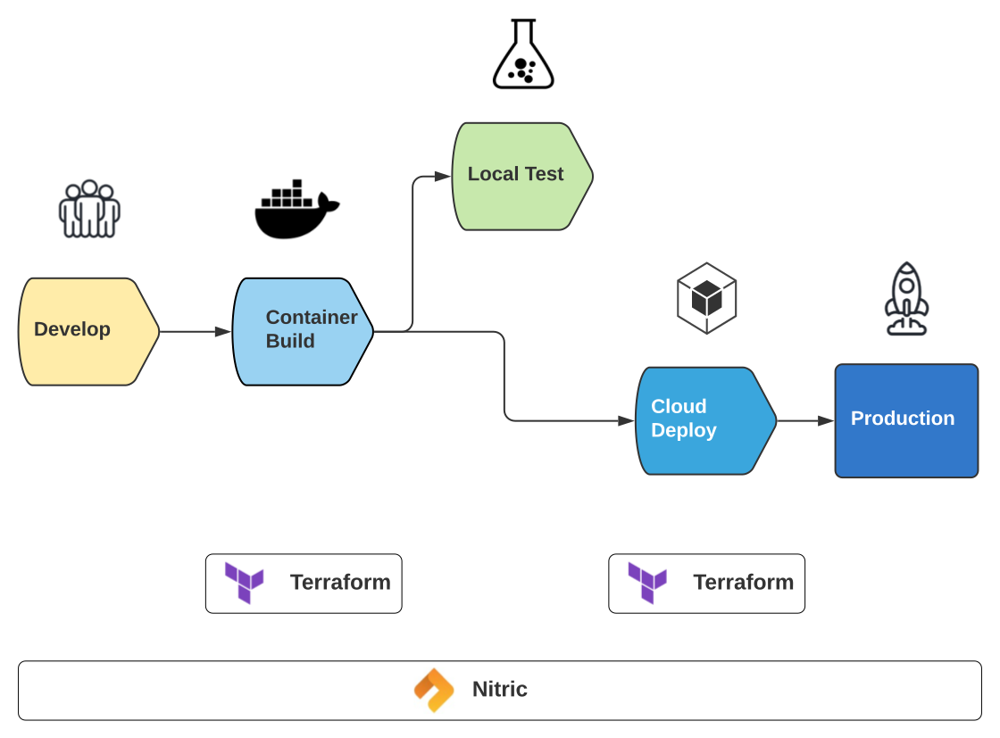

Terraform is an open-source Infrastructure as Code (IaC) software tool created by HashiCorp. With Terraform users define and provide data center infrastructure using a declarative configuration language known as HashiCorp Configuration Language (HCL).

Terraform is a powerful toolset focused on cloud deployment. Nitric in comparison covers entires software development process, leveraging tools like Docker, Pulumi and others to enable mutli-cloud development.

The diagram below illustrates coverage of Terraform and Nitric in mutli-cloud software development.

## Feature Comparison

| **Feature**                      | **Nitric** | **Terraform** |
| -------------------------------- | ---------- | ------------- |
| Open Source                      | Yes        | Yes           |
| Infrastructure as Code           | Yes        | Yes           |
| Stack Definition Format          | YAML       | HCL           |
| Stack definitions cloud agnostic | Yes        | Mostly        |
| Supported Clouds Providers       | 4          | 8             |
| CLI                              | Yes        | Yes           |
| Dev Project Templates            | Yes        | -             |
| Dev Mutli Cloud API              | Yes        | -             |
| Dev Micro Framework              | Yes        | -             |
| Dev Lanaguages Supported         | 4          | -             |
