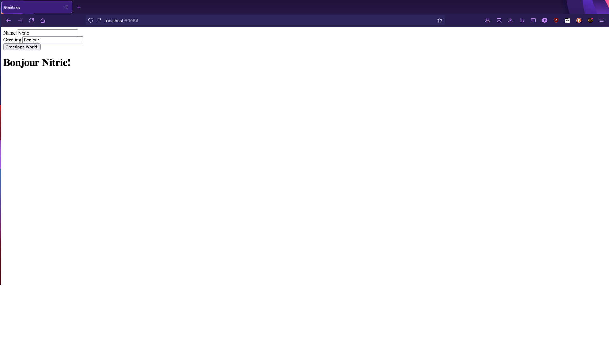

## Introduction

React is a JavaScript library that allows for building fast and complex web apps or websites.

Using the Nitric framework we can build a simple react application more efficiently and can then distribute it to any cloud.

For this tutorial you will require Node. To check if you have Node installed, run this command in your terminal:

```bash
node -v
```

If Node is installed, it should produce a version number like `v14.16.0`.

It is also assumed that you have already installed the Nitric CLI. If not visit the (installation instructions)[../installation]

### Creating the Nitric project
For this project we will make a simple react app which greets a user based on a name provided.

Using the Nitric CLI we start by creating the project.

```bash
nitric make:project nitric-greeter
```

Next we'll be asked if we want an initial service in the project and what template the service will use. For this project we will want a service. This service will handle requests for greeting and respond to the greetings. For this we will use the `nodets12` template.

```bash
? Include an example service? (Use arrow keys)
❯ function/nodets12
  function/nodejs12
  function/python37
  function/java11
  function/golang15
  server/nextjs-typescript
  none
```

Next, we'll be asked for a name for the service. We will name it greeter.

```bash
? Name for the example service? greeter
✔ Making Project my-project
✔ Making Service my-service
```

The project structure should now look like this:
```bash
nitric-greeter
|-- .nitric
|   |-- templates
|       |-- function
|           |-- nodets12
|               |-- template
|                   |-- .gitignore
|                   |-- index.ts
|                   |-- package.json
|                   |-- tsconfig.json
|               |-- .gitignore
|               |-- Dockerfile
|               |-- Dockerfile.dockerignore
|               |-- README.md
|-- .greeter
|   |-- .gitignore
|   |-- index.ts
|   |-- package.json
|   |-- tsconfig.json
|-- nitric.yaml
```

### Creating a Service
To start building our service we need to get the Nitric SDK from npm.

```bash
npm install @nitric/sdk
  or
yarn add @nitric/sdk
```

We then open up the index.ts file under the greeter directory. This is where we build the code for our greeter service.

```typescript
// import the Nitric FaaS library
import { faas } from '@nitric/sdk';

interface HelloWorldRequest {
	name: string;
  greeting: string;
}

interface HelloWorldResponse {
  response: string;
}

async function handler(request: faas.NitricTrigger<HelloWorldRequest>): Promise<HelloWorldResponse> {
	const { name, greeting = "Hello" } = request.dataAsObject();

	return { response: `${greeting} ${name}!` };
}

faas.start(handler);
```

Using this handler function we can now provide it a `HelloWorldRequest` and recieve a HelloWorldResponse. The `faas.start` hosts your function so that it can take requests. We can access this using a HTTP Request, such as cURL or Postman.

First we will start our service using this command:

```bash
nitric run
```

Once built and running you should see the following output:

```bash
✔ Building Services
✔ Creating docker network
✔ Creating Volume: nitric-greeter-vol
✔ Running Services
✔ Starting API Gateways
✔ Starting Entrypoints
Service    Port
greeter    49152
Running, press 'Q' to clean up and exit...
```

Run the cURL command substituing the port 49152 with the outputted port from the `nitric run` command:

```bash
curl -H "Content-Type: application/json" -d '{"name":"Nitric"}' http://localhost:49152/
```

This will give us a response JSON: 

```bash
{"response":"Hello Nitric!"}
```

We now know our service is working the way we want and can move on to building the react app.

### Creating the React App

We will now look at creating a react app and which utilises this greeter service. For this we will use `create-react-app`. We will be using the typescript template.

```bash
npx react-react-app greeter-ui --template typescript
  or
npm init react-app greeter-ui --template typescript
  or 
yarn create react-app greeter-ui --template typescript
```

After that has finished running, our root folder structure should have a new folder with the `greeter-ui` folder. We will remove most of the files created by the command and write our own.

```bash
greeter-ui
|-- node_modules
|-- public
|   |-- index.html
|   |-- manifest.json
|-- src
|   |-- App.tsx
|   |-- index.tsx
|-- .gitignore
|-- package.json
|-- README.md
|-- tsconfig.json
|-- yarn.lock
```

```html
<!--/public/index.html/-->
<!DOCTYPE html>
<html lang="en">
  <head>
    <meta charset="utf-8" />
    <link rel="manifest" href="%PUBLIC_URL%/manifest.json" />
    <title>Greetings</title>
  </head>
  <body>
    <div id="root"></div>
  </body>
</html>

```

```typescript
// /src/index.tsx
import React from 'react';
import ReactDOM from 'react-dom';
import App from './App';

ReactDOM.render(
  <App />,
  document.getElementById('root')
);

```

And in the App.tsx file we will create our new app. For this we will start by setting up some basic input and a button to get the greeting.

```typescript
// /src/App.tsx
import React, { useState } from 'react';

const App = () => {
  const [name, setName] = useState("Nitric");
  const [greeting, setGreeting] = useState("Hello")

  return (
    <div>
      <form>
        <label>
          Name:
          <input name="name" type="text" value={name} onChange={e => setName(e.target.value)}></input>
        </label>
        <br/>
        <label>
          Greeting:
          <input name="greeting" type="text" value={greeting} onChange={e => setGreeting(e.target.value)}></input>
        </label>
      </form>
      <button>Greetings World!</button>
    </div>
  );
}

export default App;
```

This produces a simple form where a user could input a name and a greeting and hit a button. But currently this button doesn't do anything. That's where our greeter service comes in.

The first thing we need to do, is go into our nitric.yaml file and add the new site.

```yaml
name: nitric-greeter
services:
  greeter:
    path: greeter
    runtime: function/nodets12

sites:
  greeter-ui:
    path: greeter-ui
    assetPath: ./build
    buildScripts:
      - yarn build
```

This new addition to the Nitric stack tells the `nitric run` command to look for a site at the path `/greeter-ui`, run the build script `yarn build` and then look for the assets in the `./build` directory. When `yarn build` is run, it will run `react-scripts build` which builds our react app into a ./build directory. `yarn` can be replaced with `npm` if that is your preferred package manager.

We can then define entrypoints to our app

```yaml
name: nitric-greeter
services:
  greeter:
    path: greeter
    runtime: function/nodets12

sites:
  greeter-ui:
    path: greeter-ui
    assetPath: ./build
    buildScripts:
      - yarn build

entrypoints:
  main:
    paths:
      /:
        type: site
        target: greeter-ui
      /greeter/:
        type: service
        target: greeter  
```

This tells the Nitric CLI how to build the paths and where they point. Our first path will be the site, which will be at the root. The next path is the /greeter/ path, which is where the greeter service is hosted. This greeter service will sit relative to the site and so we can use our function that way.

This can be done using a fetch statement in a new function that is called by our button. The fetch statement will make a HTTP request to our service and we will receive back our response.

```typescript
// /src/App.tsx
import React, { useState } from 'react';

const App = () => {
  const [name, setName] = useState("Nitric");
  const [greeting, setGreeting] = useState("Hello")
  const [response, setResponse] = useState("");

  async function getResponse() {
    const rawResponse = await fetch("/greeter/",{
      method: 'POST',
      body: JSON.stringify({
        name: name,
        greeting: greeting
      })
    });
    const content = await rawResponse.json();
    setResponse(content.response);
  }
  return (
    <div>
      <form>
        <label>
          Name:
          <input type="text" value={name} onChange={e => setName(e.target.value)}></input>
        </label>
        <br/>
        <label>
          Greeting:
          <input type="text" value={greeting} onChange={e => setGreeting(e.target.value)}></input>
        </label>
      </form>
      <button onClick={getResponse}>Greetings World!</button>
      <h1>{response}</h1>
    </div>
  );
}

export default App;

```

If we now use our `nitric run` command we should get a URL at the bottom. If we go to this URL in our browser it will open up into our app.

